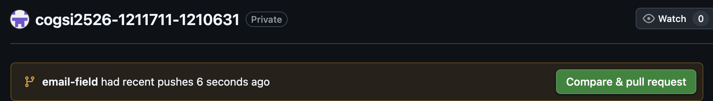
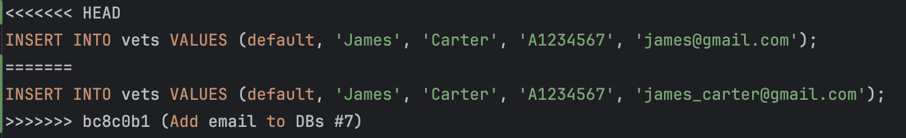

# COGSI CA1

This document is part of the _COGSI_ (Configuração e Gestão de Sistemas) class from the Software Engineering master's
course on _ISEP_ (Instituto Superior de Engenharia do Porto).

This assignment was splited into two parts.

## Part I

This part focused on working with git and **no** branches.

Also, in order to make it **easier to understand** and have a **safer history**, we will make small incremental commits.
This also makes it easier to debug, review, maintain and keeps a logical flow. This approach reduces errors and enables
straightforward corrections without the need of great effort.
During the assignments it's possible to see commits based on different components of the project (Eg. models,
repositories, ui, documentation...).
Although this is not mandatory, it's a good practice.

The commands used to implement this assignment were:

1. Create folder for CA1
    1. ```mkdir CA1``` is used to create a folder with the name _CA1_
2. Copy project to new folder and create README.md
    1. ```nano README.md``` is used to create a file with the name _README_ and with the extension _.md_
3. Initial commit and tag
    1. ```git commit -a -m "Init CA1 assignment"``` is used to save the initial changes to the repository, with the
       options _**-a**_ and _**-m**_ we add the changes to the staging area and define the message of the commit "_Init
       CA1 assignment_". An alternative to this command would be:
        1. ```git add .``` in this case we first add the changes to the staging area
        2. ```git commit -m "Init CA1 assignment"``` this way we don't need the option _**-a**_ since we already added
           the changes to the staging area and only want to commit them
    2. ```git push``` is used to send the committed changes from the local repository to the remote repository
    3. ```git tag -a 1.1.0``` is used to create an annotated tag named 1.1.0. The tag is used to define this first
       milestone which is the base of CA1 assignment
    4. ```git push origin 1.1.0``` is used to push the created tag to the remote repository, since ```git push``` only
       pushes commits
4. Update Vet model
    1. Update
       the [Vet.java](./spring-framework-petclinic/src/main/java/org/springframework/samples/petclinic/model/Vet.java)
       file
    2. ```git commit -am "Add professionalLicenseNumber support to Vet model"``` here we simplify the options used
       before into a single one "_**-am**_" with the exact same behaviour
    3. ```git push```
5. Update Vet repository
    1. Update
       the [JdbcVetRepositoryImpl.java](./spring-framework-petclinic/src/main/java/org/springframework/samples/petclinic/repository/jdbc/JdbcVetRepositoryImpl.java)
       file
    2. Update the h2 database data and schemas
    3. ```git commit -am "Update Vet repository and db schemas"``` we want functional small and
    4. ```git push```
6. Update Vet UI
    1. Update
       the [vetList.jsp](/Users/ctw02859/Desktop/ISEP/COGSI/cogsi2526-1211711-1210631/CA1/spring-framework-petclinic/src/main/webapp/WEB-INF/jsp/vets/vetList.jsp)
       file
    2. ```git commit -am "Update Vet list UI"```
    3. ```git push```
7. Update previous data base schemas and data
    1. Update database data and schemas regarding owner (only the missing ones)
    2. ```git commit -am "Add NIF to Owners on all DBs"```
    3. ```git push```
8. Sanitize other Vet databases
    1. Update missing vet database data and schemas
    2. ```git commit -am "Add professionalLicenseNumber to DB's"```
    3. ```git push```
9. Tag new feature
    1. ```git tag -a 1.2.0```
    2. ```git push origin 1.2.0```
10. Revert commit
    1. ```git log --oneline``` in order to see all of the commits as well as their hashes
    2. ```git revert d9a8f77``` in order to revert the commit itself, we also could use ```git revert HEAD``` since in
       this case the HEAD was the wanted commit to be reverted
11. Update Readme
    1. Add all commands and context to the CA1 [README.md](README.md)
    2. ```git commit -am "Add explanation for context and commands. Closes #6"``` in this commit the message contains
       the keyword used to close the task with id [#6](https://github.com/1211711/cogsi2526-1211711-1210631/issues/6)
12. Create final tag
    1. ```git tag -a ca1-part1``` this tag marks the end of this part of the assignment

**Q1:** Show which is the repository’s default branch and when was its latest commit made

**R:**
```git symbolic-ref HEAD``` or ```git symbolic-ref refs/remotes/origin/HEAD``` to retrieve based
on remote.

**Q2:** Show how many distinct contributors made commits in the
repository

**R:**
```git shortlog -sn``` or ```git shortlog -n``` to validate which commits were made by each contributor.

## Part II

This part focused on working with git and **with** branches.

In this Part, we will develop a new feature, however, in a more structured way, by using branches.
Using branches in Git allow us to work on features, fixes, or experiments in isolation without affecting the main code (in the main branch).
This enables safer development, easier collaboration, and cleaner project history.

The command used to implement this assignment were:

1. Verify in which branch we're currently in
    1. ```git branch``` is used to manage branches in a Git repository. This command will display all of the branches,
       highlighting the one we're currently in.
    2. We were actually already in the **main** branch, which is what we want, because we want to create the feature branch
       based on this. However, if we weren't, we could easily switch branch by ```git switch main```.

2. Update main branch
    1. ```git pull``` fetches changes from a remote repository and automatically merges them into the current branch.
    2. With this we now have the main branch up-to-date.

3. Create feature branch
    1. ```git switch -c email-field``` was used in order to create a new branch based on the current branch we are in (**main**).
       In a normal scenario we would add the prefix *feature/* to the branch name, so that the intention of the branch is recognizable.
       However, that was not the desired branch name in this assignment.
    2. An alternative would be to use ```git checkout -b email-field```. Both have the same result. The difference between
       them, in this case, is the semantic. Although ```git checkout``` can also be used to restore files in the working directory and checkout past commits.

4. Publish feature branch
    1. ```git push --set-upstream origin email-field``` was used in order to publish the branch to the repository, so that other members could access to it.
    2. It was not strictly necessary to push the branch at the moment, but as a good practice we decided to.

5. Develop feature and commit
    1. Following the steps made on the previous part, we did small incremental commits such as *Add email to Vet model #7*,
       *Update repository layer #7*, *Update Vet view #7* and *Add test for vet email #7*
    2. ```git commit -am "[COMMIT MESSAGE] #[ISSUE NUMBER]``` was the command used to commit the changes and relate them to the issue in question.
    3. ```git push``` was once again used to push the commit to the remote repository

6. Create Pull Request
    1. A pull request is a request to merge code from one branch into another. This way other developers can review the code changes
       before the code is merged onto the main development branch.
    2. The pull request was created in github since git alone can't create pull requests. This was done using the UI however
       it is possible to do it by using the github cli command ```gh pr create --base main --head email-field --title "Add email 
   field feature" --body "Implements email field functionality. Closes #7"```.
   
    3. An important note is that in the pull request description *Closes #7* was added in order to automatically close the issue number 7 upon closing the pull request.

7. Merge Pull Request
    1. When merging a pull request there are 3 available options
        1. *Merge commit:* Creates a merge commit preserving full history.
        2. *Squash and merge:* Combines all commits into one before merging.
        3. *Rebase and merge:* Reapplies commits on top of the target branch without a merge commit.
    2. In this case we decided to do *Squash and merge* since it creates a clean, single commit summarizing all changes, keeping the main branch history simple and easy to follow.

8. Tag latest feature
   1. ```git tag -a 1.3.0``` was used in order to tag the latest developments 

9. Create a conflict branch
    1. Before merging the email-field pull request, a branch named *add-data* was created from main. In this branch a *data.sql* file
       was updated in order to generate a conflict with the *email-field* branch.
    2. After the email-field pull request was close ```git pull``` was made, updating the main branch
    3. ```git rebase origin``` rebased the main branch into the current one. This way we ensure our feature branch is based on the latest stable or development code

10. Resolve conflicts
    1. As expected the ```git rebase origin``` command generate conflicts, since there were overlapping changes in the *data.sql* file.
    
    2. We manually resolved the conflict and finished the rebase using ```git add```to stage the resolved files and ```git rebase --continue``` to finalize 
    3. ```git push``` was done to update the remote branch

11. Create and close add-data pull request
    1. A new pull request for the add-data branch was created and closed, using the same strategy previously mentioned.

12. Update documentation
    1. The README-md was update, using the same pull request strategy

13. Tag assignment
    1. ```git tag -a ca1-part2``` was used to tag the assignment


## Alternative solutions
### Git vs Mercurial vs SVN

#### Main Differences

| Feature                | **Git**                                          | **Mercurial (Hg)**                             | **SVN**                                        |
|------------------------|--------------------------------------------------|------------------------------------------------|------------------------------------------------|
| **Type**               | Distributed                                      | Distributed                                    | Centralized                                    |
| **Ease of Use**        | Powerful but complex                            | Simpler and more user-friendly                 | Easiest for basic tasks                        |
| **Branching**          | Lightweight, flexible branches                  | Named branches and bookmarks                   | Directory-based (manual copies)               |
| **History Rewriting**  | Allowed (`rebase`, `reset`, etc.)               | Discouraged (history is immutable)             | Not supported                                  |
| **Offline Support**    | Full                                             | Full                                           | Very limited                                   |
| **Staging Area**       | Yes (`git add` to stage changes)                | Yes (`hg add`, auto-stages edits)              | No real staging (only new files need `add`)    |
| **Tagging**            | Native, lightweight (`git tag`)                 | Native (`hg tag`)                              | Simulated using `svn copy` to a `/tags` folder |
| **Popularity**         | Industry standard, used by GitHub, GitLab, etc. | Declining, but clean design                    | Still used in some enterprise/legacy projects  |

---

#### Git vs Mercurial vs SVN – Command Equivalents & Descriptions

| **Git Command**                                 | **Mercurial (Hg)**                              | **SVN**                                               | **Description** |
|--------------------------------------------------|--------------------------------------------------|--------------------------------------------------------|------------------|
| `git init`                                       | `hg init`                                       | `svnadmin create` (repo) + `svn checkout` (client)     | Initialize a repository (local for Git/Hg, server+client in SVN) |
| `git clone <url>`                                | `hg clone <url>`                                | `svn checkout <url>`                                  | Clone or checkout a remote repository |
| `git status`                                     | `hg status`                                     | `svn status`                                          | Show current working directory state |
| `git add <file>`                                 | `hg add <file>`                                 | `svn add <file>`                                      | Stage a new file (only needed for **new** files in SVN) |
| `git commit -m "msg"`                            | `hg commit -m "msg"`                            | `svn commit -m "msg"`                                 | Save changes (Git/Hg to local repo, SVN directly to remote) |
| `git log`                                        | `hg log`                                        | `svn log`                                             | Show commit history |
| `git diff`                                       | `hg diff`                                       | `svn diff`                                            | Show changes in working directory |
| `git revert <commit>`                            | `hg backout <rev>`                              | `svn merge -c -<rev> . && svn commit -m "Revert"`     | Revert a previous commit (Hg keeps clean history, SVN uses reverse merge) |
| `git tag -a 1.1.0 -m "msg"`                      | `hg tag 1.1.0 -m "msg"`                         | `svn copy trunk tags/1.1.0 -m "Tag 1.1.0"`            | Tag a version. **SVN does this by copying code to a `/tags` folder** |
| `git branch feature-x`                           | `hg branch feature-x`                           | `svn copy trunk branches/feature-x -m "Branch"`       | Create a branch. In SVN, it's a **copy to `/branches`** |
| `git checkout feature-x`                         | `hg update feature-x`                           | `svn switch ^/branches/feature-x`                     | Switch to another branch (working copy update) |
| `git push`                                       | `hg push`                                       | `svn commit`                                          | Send local commits to remote (SVN commits go directly to remote) |
| `git pull`                                       | `hg pull -u`                                    | `svn update`                                          | Download and integrate remote changes |

---

#### Additional Notes

- **Git & Mercurial use a staging area** (you `add` changes before committing).  
  SVN **commits all changes directly**, so **you only need `svn add` for new files**.

- **Tagging in SVN** is not a true tag — it's a convention using a `copy` of the current project into a `/tags` directory:
  ```bash
  svn copy ^/trunk ^/tags/1.1.0 -m "Tag 1.1.0"


## Developers

| Name       | Number  | Evaluation |
|------------|:-------:|:----------:|
| João Sousa | 1210631 |    100%    |
| João Brito | 1211711 |    100%    |
