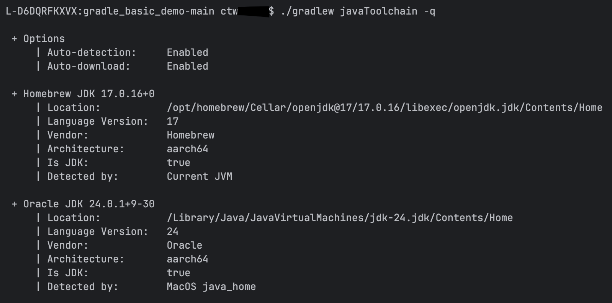

# COGSI CA2

This document is part of the _COGSI_ (Configuração e Gestão de Sistemas) class from the Software Engineering master's
course on _ISEP_ (Instituto Superior de Engenharia do Porto).

This assignment was splited into two parts. This documents is only for Part I.

## Part I

This part focused on working with **_gradle_** and keeping the good practices learned and used in the previous
assignments.
Because of that, some steps will be simplified (like _commits_ and _pull requests_) but such commands can be seen
in [CA1 README](../../CA1/README.md).

The steps used to implement this assignment were:

1. Initial project
    1. Download the [gradle_basic_demo](https://github.com/lmpnogueira/gradle_basic_demo) project into the
       folder [CA2/Part1/gradle_basic_demo](./gradle_basic_demo-main)

2. Create initial tag
    1. Experiment the downloaded project
        1. Build the app by running `./gradlew build`
            1. By using the **wrapper** (_./gradlew_ instead of _gradle_) ensures consistent builds across all
               environments
               by automatically downloading and using the correct tool version, removing the need for manual setup and
               providing a reliable, automation-friendly build process for CI/CD.
            2. The command _**build**_ "is made up of several key components that work together to automate tasks like
               compiling code, running tests, and packaging artifacts" [[docs.gradle][1]]
        2. Start a server by running
           `java -cp build/libs/basic_demo-0.1.0.jar basic_demo.ChatServerApp <server port>` (replace <server_port>
           with the port you want to use, eg. 59001)
        3. Start multiple clients by running `./gradlew runClient`. This command triggers the task _runClient_ in
           the [build.gradle](./gradle_basic_demo-main/build.gradle)
    2. Create the tag **_ca2-1.1.0_** following the pattern _**major.minor.revision**_ which allows developers and
       stakeholders to easily know when the project has:
        1. Major --> Breaking changes
        2. Minor --> New feature without braking existing ones
        3. Revision --> Small changes or bugfixes

3. Add _runServer_ task
    1. Create a new branch (eg:
       _[feature/issue-11/add_gradle_tasks](https://github.com/1211711/cogsi2526-1211711-1210631/compare/feature/issue-11/add_gradle_tasks)_)
    2. Add a task on [build.gradle](./gradle_basic_demo-main/build.gradle):
        ```gradle
        task runServer(type:JavaExec, dependsOn: classes) {
            group = "DevOps"
            description = "Launches a chat server on localhost:59001 "
     
            classpath = sourceSets.main.runtimeClasspath
     
            mainClass = 'basic_demo.ChatServerApp'
     
            args '59001'
        }
        ```
        1. The new task is of type `JavaExec` which starts a JVM with the given classpath and application class
        2. The new task runs after the `classes` task because of the argument `dependsOn: classes`
        3. The `mainClass` is assigned to `basic_demo.ChatServerApp` which defines the entry point for the
           application.
        4. The `args` keyword specifies the command-line arguments that will be passed to the program when it runs.
           In this case used to specify the port used
    3. The new task created can replace the initial command
       `ava -cp build/libs/basic_demo-0.1.0.jar basic_demo.ChatServerApp <server port>` by simply running
       `./gradlew runServer`
    4. Commit this change, following small incremental commits pattern (Eg. _**"Add runServer task to gradle #11"**_ )

4. Add a unit test
    1. Continue to use the branch created on the last step
    2. Add _junit_ dependency to [build.gradle](./gradle_basic_demo-main/build.gradle):
        ```gradle
        dependencies {
            ...
            testImplementation 'org.junit.jupiter:junit-jupiter-api:5.8.1'
            testRuntimeOnly 'org.junit.jupiter:junit-jupiter-engine:5.8.1' 
            ...
        }
        ```
        1. To make the file easier to maintain and to be more consistent we can define a variable for the junit version
           and then use it like `${junitVersion}"`
    3. Add a task in [build.gradle](./gradle_basic_demo-main/build.gradle) in order to run the tests from the _junit_
       framework:
        ```gradle
        tasks.named('test', Test) {
            useJUnitPlatform()
        }
        ```
        1. `tasks.named('test', Test)` --> finds the existing test task of type Test
        2. `useJUnitPlatform()` --> tells Gradle to run tests using JUnit 5 instead of the older JUnit 4 engine
    4. Commit the changes

5. Add a task for copying files
    1. Continue to use the branch created on the last step
    2. Add a task in [build.gradle](./gradle_basic_demo-main/build.gradle) in order to copy the files from the src
       folder to a backup folder:
        ```gradle
        task copySource(type: Copy) {
            from 'src'
            into 'backup'
        }
        ```
        1. The new task is of type `Copy`, which is a built-in Gradle task type used to copy files and/or
           directories
        2. The `from` keyword defines the source directory. In this case, the folder `src` that contains the
           files to be copied
        3. The `into` keyword defines the destination directory as `backup`, where the copied files will be
           placed
    3. Test the task by running `./gradlew copySource`
    4. Commit the changes

6. Add a backup task
    1. Continue to use the branch created on the last step
    2. Add a task in [build.gradle](./gradle_basic_demo-main/build.gradle) in order to zip the files copied in the last
       step:
        ```gradle
        task zipBackup(type: Zip, dependsOn: copySource) {
            from 'backup'
            archiveFileName = 'Backup.zip'
        
            destinationDirectory = file('build/zips')
        }
        ```
        1. This task is of type `Zip`, which is a built-in Gradle task used to create ZIP archives
        2. It has a dependency by specifying `dependsOn: copySource`, meaning it will run only after the `copySource`
           task finishes, ensuring the backup folder exists
        3. The `from` keyword defines the source directory to include in the ZIP, in this case `backup`
        4. The `archiveFileName` property sets the name of the ZIP file to be created as `Backup.zip`
        5. The `destinationDirectory` property specifies where the ZIP file will be saved, in this case in `build/zips`

    3. Test the task by running ```./gradlew zipBackup```, this will run firstly the `copySource` task and only after
       will run the `zipBackup` task.
    4. Commit the changes

7. Create and close add_gradle_tasks pull request
    1. A new pull request for the add_gradle_tasks branch was created and closed, using the same strategy as in previous
       assignments

8. Update documentation
    1. The [README.md](./README.md) was update, using the same pull request strategy as previously

9. Tag assignment
    1. ```git tag -a ca2-part1``` was used to tag the assignment

-------
**Q1:** Explain how the _**Gradle Wrapper**_ and the _**JDK Toolchain**_ ensure the correct versions of _Gradle_ and the
_Java Development Kit_ are used without requiring manual installation.

**R:**
The Gradle Wrapper automatically downloads and runs the exact Gradle version specified by the project, eliminating the
need for developers to manually install or configure Gradle. The JDK Toolchain, configured in build.gradle, specifies
the required Java version for compilation and execution, and Gradle automatically selects a compatible JDK on the system
or downloads one if necessary.
--------
**Q2:** In the root directory of the application, run `./gradlew –q javaToolchain` and explain the output

**R:**
Running the above command gradle fails because the option is placed badly. But if you fix the command to
`./gradlew javaToolchain -q` it will output the information about the Java toolchains that Gradle will use for this
project. More specifically prints the vendor, version and installation path of the JDK used by gradle.


--------

## Developers

| Name       | Number  | Evaluation |
|------------|:-------:|:----------:|
| João Sousa | 1210631 |    100%    |
| João Brito | 1211711 |    100%    |

[1]: https://docs.gradle.org/current/userguide/gradle_directories_intermediate.html "Gradle Build explanation"
