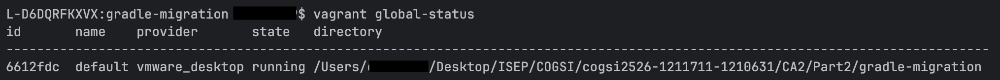
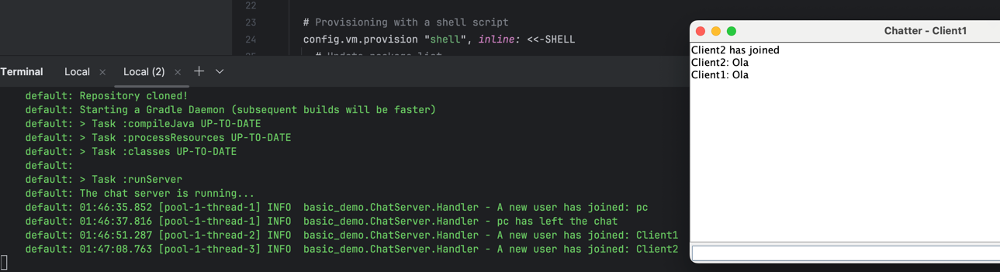
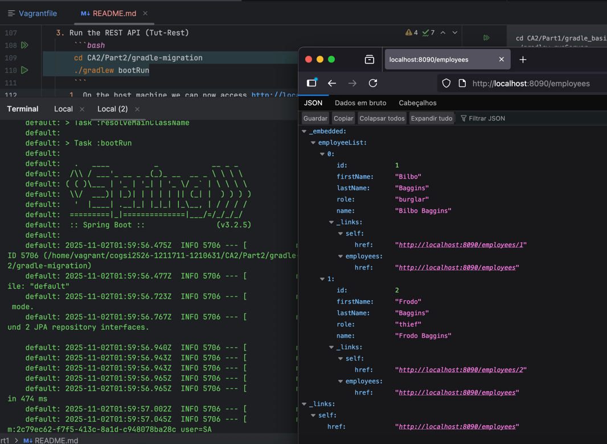

# COGSI CA3

This document is part of the _COGSI_ (Configuration and Systems Management) class from the Software Engineering master's
course at _ISEP_ (Instituto Superior de Engenharia do Porto).

This assignment focused on using **Vagrant** to automate the creation and provisioning of virtual machines for software
development and testing. The goal was to create a fully automated setup capable of building, running, and managing 
multiple applications within a controlled environment.

---

## Part I — Virtual Machine Provisioning

This part focused on creating a virtual machine (VM) using **Vagrant**, automating dependency installation, and cloning 
the project repository inside the VM.

### 1. Install Vagrant on Host Machine

1. Install **Vagrant**:
    ```bash
    brew tap hashicorp/tap
    brew install hashicorp/tap/hashicorp-vagrant
    ```
   
2. Check **Vagrant** installation
   ```bash
   vagrant --version
    ```
3. Install the **VMware** plugin:
    ```bash
    vagrant plugin install vagrant-vmware-desktop
    ```
    > **Note:** This command initially failed on a macOS machine because the folder `/opt/vagrant-vmware-desktop/` was not created.  
    To fix this, Vagrant was installed manually using the installer from  
    [https://developer.hashicorp.com/vagrant/install/vmware](https://developer.hashicorp.com/vagrant/install/vmware).
   
    > As an alternative, **VirtualBox** could also be used.

---

### 2. Initialize and Start the Virtual Machine (VM)

1. Inside the CA3 folder:
    ```bash
    vagrant init bento/ubuntu-22.04
    ```
   1. With the `bento/ubuntu-22.04` option the vagrant init command initiates the Vagrant file with `config.vm.box = "bento/ubuntu-22.04"`
2. Start and provision the VM:
    ```bash
    vagrant up --provision
    ```
   1. This command boots up the machine and fires provision. The option `--provision` should be used since by default, a provisioner only runs once.
3. Check the VM status:
    ```bash
    vagrant global-status
    ```
   1. The result should be something like:


---

### 3. Provisioning Script (Dependencies and Automation)

1. Install dependencies on VM
    1. Add a provisioning shell script to [Vagrantfile](Vagrantfile)
        ```bash
        # Provisioning with a shell script
        config.vm.provision "shell", inline: <<-SHELL
            # Update package list
            sudo apt-get update
            # Install some packages
            sudo apt-get install -y git curl vim openjdk-17-jdk open-vm-tools
        
            echo "Provisioning complete!"
        SHELL
        ```
    2. Add port forwarding on VM
       ```ruby
        config.vm.network "forwarded_port", guest: 59001, host: 59001
        config.vm.network "forwarded_port", guest: 8080, host: 8090
       ```
        1. This is done so that the host machine can access to the applications running inside the VM.    

2. Start and Access the VM
    ```bash
    vagrant up --provision
    vagrant ssh
    ```
    > The command `vagrant ssh`, logs in into th VM via ssh and is useful when we want to make
      manual changes or debug.

3. Once inside the VM:
   1. We clone the repository so that we can test the previous assignments now inside the vm
       ```bash
       git clone https://github.com/1211711/cogsi2526-1211711-1210631.git
       cd cogsi2526-1211711-1210631
       ```

   2. Run the Chat Server (Gradle Basic Demo)
       ```bash
       cd CA2/Part1/gradle_basic_demo-main
       ./gradlew runServer
       ```
        1. On the Host machine we can now run the clients (Follow the [Readme](./../../CA2/Part1/README.md) file for tutorial on that)
        

   3. Run the REST API (Tut-Rest)
       ```bash
       cd CA2/Part2/gradle-migration
       ./gradlew bootRun
       ```
      1. On the host machine we can now access http://localhost:8090/employees and confirm that the host has access to the application running on the VM
        

---

### 4. — Automate Steps

1. Add environment variables to provision script
    ```bash
     export REPO_CLONE=${REPO_CLONE:-true}
     export START_SERVER=${START_SERVER:-false}
     export START_TUT_REST=${START_TUT_REST:-false}
    ```

2. Use variables to select which step is executed
    ```bash
    if [ "$REPO_CLONE" == "true" ]; then
        cd /home/vagrant/
        git clone https://github.com/1211711/cogsi2526-1211711-1210631.git
        cd cogsi2526-11211711-11210631
        git checkout feature/issue-17/add_basic_vangard_setup
        echo "Repository cloned!"
    fi

    if [ "$START_SERVER" == "true" ]; then
        cd /home/vagrant/cogsi2526-1211711-1210631/CA2/Part1/gradle_basic_demo-main
        ./gradlew runServer
        echo "Starting server..."
    fi

    if [ "$START_TUT_REST" == "true" ]; then
        cd /home/vagrant/cogsi2526-1211711-1210631/CA2/Part2/gradle-migration
        ./gradlew bootRun
        echo "Starting REST API..."
    fi
    ```

3. Run provision with a specific step
   1. We can now run the command ```START_SERVER=true vagrant reload --provision``` which will restart the VM and execute the provision script and the step `START_SERVER`

The use of **environment variables** allows flexible control during provisioning:

| Variable         | Default | Description                                         |
| ---------------- | :-----: | --------------------------------------------------- |
| `REPO_CLONE`     |  `true` | Whether to clone the repository during provisioning |
| `START_SERVER`   | `false` | Whether to start the Chat Server automatically      |
| `START_TUT_REST` | `false` | Whether to start the REST API automatically         |

---

### 5. — Persistent Database Configuration

To ensure that the H2 database persists across VM restarts, a shared folder was configured between the VM and host:

```ruby
config.vm.synced_folder "./shared", "/vagrant"
```

Then, the **application.properties** file in the REST API project was updated to store data on disk instead of in memory:

```properties
spring.datasource.url=jdbc:h2:file:./database
```

This configuration allows H2 to save data in a physical file inside the shared folder, ensuring persistence even after
restarting the VM.

---

## Alternative Solutions

As an alternative to using **Vagrant**, we explored other tools that provide similar environment automation and provisioning capabilities — namely **Docker Compose** and **Packer**.  
Both solutions can achieve similar outcomes, but each with distinct approaches and advantages depending on the project requirements.

---

### 1. Docker and Docker Compose

**Docker** is a container-based virtualization platform that allows isolating applications in lightweight, reproducible environments.  
Unlike Vagrant, which relies on full virtual machines, Docker containers share the host OS kernel, leading to faster startup times and reduced resource usage.

#### Advantages

- **Lightweight and fast** — Containers start almost instantly and require fewer resources than virtual machines.  
- **Easy orchestration** — With **Docker Compose**, multiple containers (e.g., app + database) can be defined and started from a single file.  
- **Cross-platform consistency** — The same container image can run identically across any environment.  
- **Ideal for CI/CD pipelines** — Docker integrates seamlessly into automated build and deployment processes.

#### Workflow Comparison

| Task                   | Vagrant Command              | Docker Equivalent                       |
|------------------------|------------------------------|-----------------------------------------|
| Initialize environment | `vagrant init`               | `docker init`                           |
| Start environment      | `vagrant up`                 | `docker-compose up`                     |
| Re-provision / rebuild | `vagrant reload --provision` | `docker-compose up --build`             |
| Stop environment       | `vagrant halt`               | `docker-compose down`                   |
| Destroy environment    | `vagrant destroy`            | `docker system prune -a`                |
| Connect to instance    | `vagrant ssh`                | `docker exec -it <container_name> bash` |

With Docker, services are defined declaratively and orchestrated through a YAML file, offering a more modern and efficient approach than traditional VM-based setups.

---

### 2. Comparison Summary

| Feature                | Vagrant                       | Docker Compose              |
|------------------------|-------------------------------|-----------------------------|
| Virtualization Type    | Full Virtual Machines         | OS-level Containers         |
| Performance            | Slower (heavyweight)          | Fast (lightweight)          |
| Resource Usage         | High                          | Low                         |
| Persistent State       | Yes                           | Yes (via volumes)           |
| Best Use Case          | Full environment simulation   | Microservices & development |
| Configuration Language | Ruby (`Vagrantfile`)          | YAML (`docker-compose.yml`) |
| Parallel Execution     | Limited                       | Native support              |
| Integration            | Works with VirtualBox, VMware | Works with Docker Engine    |

---

### 3. Conclusion

While **Vagrant** remains a great tool for teaching and simulating virtualized environments,
**Docker Compose** offers a faster and more lightweight option for containerized development.

In modern DevOps workflows, combining these tools can yield powerful results — for example:

* Deploy and orchestrate services with **Docker Compose**,
* And manage development environments with **Vagrant** if full virtualization is still required.

---

## Developers

| Name       |  Number | Evaluation |
| ---------- | :-----: | :--------: |
| João Sousa | 1210631 |    100%    |
| João Brito | 1211711 |    100%    |
