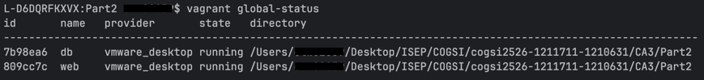

# COGSI CA3

This document is part of the _COGSI_ (Configuration and Systems Management) class from the Software Engineering master's
course at _ISEP_ (Instituto Superior de Engenharia do Porto).

## Part II

The goal of this part was to extend the Vagrant setup by configuring a **multi-VM environment**, simulating a real-world deployment scenario with separate application and database servers.  
This approach promotes a better understanding of distributed environments, network configuration, and inter-service communication.

The main goal of this assignment was to configure **two virtual machines (VMs)** using **Vagrant**:
- One VM running the **REST API application (web VM)**  
- One VM running the **H2 Database Server (db VM)**  

This configuration mimics a production-like environment, where application and database servers are isolated but communicate through a private network.

---

### 1. Virtual Machine Setup

Both virtual machines are defined in a single `Vagrantfile` configuration.  
Each VM has a specific purpose and provisioning logic and are defined by adding a global provisioning (that runs ob both machines) and defining both virtual machines:

```ruby
...
  # Global provisioning (common setup)
  config.vm.provision "shell", inline: <<-SHELL
    sudo apt-get update
    sudo apt-get install -y git

    # Clone repository
    cd /home/vagrant/
    git clone https://github.com/1211711/cogsi2526-1211711-1210631.git
    cd cogsi2526-1211711-1210631
    git checkout feature/issue-19/setup_multiple_virtual_machines
    git pull

    echo "Global provisioning complete!"
  SHELL

  # Database VM
  config.vm.define "db" do |db|
    db.vm.hostname = "db-server"

    db.vm.provision "shell", inline: <<-SHELL
      sudo apt-get install -y openjdk-17-jdk

      echo "DB provisioning complete!"
    SHELL
  end

  # Application VM
  config.vm.define "web" do |web|
    web.vm.hostname = "web-server"

    web.vm.provision "shell", inline: <<-SHELL
      sudo apt-get install -y openjdk-17-jdk netcat

      echo "Web provisioning complete!"
    SHELL
  end
  
...
````

After defining the VM's we can run `vargrant up db` or `vagrant up web` for running a VM individually.

Running `vagrant up` starts both machines:


---

### 2. Database Configuration (H2 Server Mode)

For this setup, the H2 database must run in **server mode** on the **db VM**, so that the **web VM** can connect remotely.

#### Updated `application.properties`

```properties
spring.datasource.url=jdbc:h2:tcp://192.168.33.11:9092/database
spring.datasource.driverClassName=org.h2.Driver
spring.datasource.username=sa
spring.datasource.password=
spring.jpa.defer-datasource-initialization=true
spring.jpa.generate-ddl=true
spring.jpa.hibernate.ddl-auto=update
```

This configuration connects the Spring Boot application running on `web-server` to the H2 server running on the IP `192.168.33.11`, port `9092`.

#### Updated `build.gradle`

```gradle
tasks.register('startH2Server', JavaExec) {
    description = 'Starts the H2 database'
    group = "build"

    classpath = sourceSets.main.runtimeClasspath
    mainClass = 'org.h2.tools.Server'
    args = ['-tcp', '-tcpAllowOthers', '-tcpPort', '9092', '-baseDir', '/home/vagrant/shared']
}
```

This task ensures the database listens for external connections from the web VM and stores data in a shared directory (`/home/vagrant/shared`).

#### Updated `Vagrantfile`

```ruby
  config.vm.define "db" do |db|
    db.vm.hostname = "db-server"

    # Setup a static id to allow VM web to connect
    db.vm.network "private_network", ip: "192.168.33.11"
    db.vm.network "forwarded_port", guest: 9092, host: 9092

    db.vm.provision "shell", inline: <<-SHELL
      sudo apt-get install -y openjdk-17-jdk

      cd /home/vagrant/
      mkdir -p shared/database

      echo "Starting H2 Server..."
      cd /home/vagrant/cogsi2526-1211711-1210631/CA2/Part2/gradle-migration
      ./gradlew startH2Server

      echo "DB provisioning complete!"
    SHELL
  end
  
  ...
  
    web.vm.provision "shell", inline: <<-SHELL
      ...
      
      echo "Starting REST API..."
      cd /home/vagrant/cogsi2526-1211711-1210631/CA2/Part2/gradle-migration
      ./gradlew bootRun
    
      echo "Web provisioning complete!"
    SHELL
```

Testing, **web VM** can already listen the **db VM** port:


---

### 3. Resource Allocation

To avoid performance issues, both VMs should be configured with appropriate resources.

#### Updated `Vagrantfile`

```ruby
 db.vm.provider :vmware_desktop do |vmware|
   vmware.memory = 1024
 end

 web.vm.provider :vmware_desktop do |vmware|
   vmware.memory = 2048
   vmware.cpus = 2
 end
```

---

### 4. Secure SSH Access (Custom Keys)

1. **Create a shared folder for keys**
    - A `./shared` folder is synced to `/vagrant` inside the VM:
    ```ruby
    config.vm.synced_folder "./shared", "/vagrant"
    ```
    1. __ssh-keygen -t rsa -b 4096 -f ~/.ssh/ssh_vagrant_key__ was used in order to generate the custom SSH keys inside the respective folder.


2. **Configure Vagrant to use custom SSH keys**
    ```ruby
    config.ssh.insert_key = false
    config.ssh.private_key_path = ["./.ssh/ssh_vagrant_key"]
    config.vm.provision "file", source: "~/.ssh/ssh_vagrant_key.pub", destination: "/home/vagrant/.ssh/authorized_keys"
    ```
    1. `config.ssh.insert_key = false` prevents Vagrant from generating a new default SSH key. This ensures your custom key is used.
    2. `config.ssh.private_key_path` points Vagrant to the custom private key (`ssh_vagrant_key`) for secure SSH login.
    3. `config.vm.provision "file"` copies the public key (`ssh_vagrant_key.pub`), storing it as `/home/vagrant/.ssh/authorized_keys`. This allows passwordless, secure login to the VM using the private key.


3. **Set proper permissions for SSH keys inside the VM**
    ```bash
    chown -R vagrant:vagrant /home/vagrant/.ssh
    chmod 600 /home/vagrant/.ssh/authorized_keys
    ```
    1. `chown -R vagrant:vagrant /home/vagrant/.ssh` changes ownership of the `.ssh` folder and its contents to the `vagrant` user. This ensures the Vagrant user can read the keys.
    2. `chmod 600 /home/vagrant/.ssh/authorized_keys` sets strict permissions so only the owner (`vagrant`) can read/write the `authorized_keys` file. SSH refuses to use keys with overly permissive permissions for security reasons.

---

### 5. Application Startup Check

To ensure the application VM waits until the database is ready, a **startup check** was added using `netcat (nc)`:

```ruby
    web.vm.provision "shell", inline: <<-SHELL
      ...

      while ! nc -z 192.168.33.11 9092; do
        echo "H2 db is not available, waiting 3 seconds"
        sleep 3
      done

      echo "Starting REST API..."
      ...

      echo "Web provisioning complete!"
    SHELL
```

This logic guarantees that the Spring Boot application starts only after the H2 database is fully operational.

---

### 6. Network Security (Firewall Configuration)

The database VM was further secured using **UFW (Uncomplicated Firewall)**, allowing only the web VM to access the H2 service.
1. **Install UFW and required packages on DB VM**
    ```bash
    sudo apt-get install -y ufw
    ```
    1. `ufw` (Uncomplicated Firewall) is a tool to easily configure Linux firewall rules.


2. **Enable the firewall**
    ```bash
    sudo ufw --force enable
    ```
    1. Enables UFW so that firewall rules are applied.
    2. The `--force` option skips confirmation prompts to allow automated provisioning.


3. **Allow connections only from the Web VM**
    ```bash
    sudo ufw allow from 192.168.33.12 to any port 9092
    sudo ufw deny 9092
    ```
    1. `sudo ufw allow from 192.168.33.12 to any port 9092` opens port `9092` on the DB VM **only** for the Web VM (`192.168.33.12`). This ensures that only the app VM can communicate with the H2 database.
    2. `sudo ufw deny 9092` blocks all other IP addresses from accessing the same port. Together, these rules implement a **whitelist** approach, improving security.
    3. We also ensure the Web VM has a fixed IP to match this rule:
       ```ruby
       web.vm.network "private_network", ip: "192.168.33.12"
       ```

4. **Verify UFW rules**
    ```bash
    sudo ufw status verbose
    ```
    1. Displays the current firewall rules and their status.
    2. Expected output:
       ```
       9092                       ALLOW       192.168.33.12
       9092                       DENY        Anywhere
       ```

---

## Alternative Solutions

For Part II, instead of comparing Vagrant directly with other provisioning tools (as done in Part I), we explored **alternative approaches to orchestrating multiple isolated services** — specifically, ways to simulate an application-and-database architecture using modern DevOps tools.

### 1. Docker Compose / Kubernetes

Using **Docker Compose** (or **Minikube** for Kubernetes) can replace the two-VM topology with two lightweight containers — one running the Spring Boot application and another running the H2 or PostgreSQL database.  
Each container runs in its own isolated environment but shares a virtual network for inter-service communication.

**Advantages**
- Faster startup and lower resource consumption compared to two full VMs.
- Built-in network isolation and automatic service discovery.
- Simplified scaling and environment replication using a single `docker-compose.yml` or Kubernetes manifest.

**Workflow Comparison**

| Task | Vagrant (2 VMs) | Docker Compose (2 containers) |
|------|------------------|-------------------------------|
| Define machines/services | Two `config.vm.define` blocks | Two `services:` entries |
| Start both environments | `vagrant up` | `docker-compose up` |
| Inter-service networking | Private IPs (`192.168.x.x`) | Internal bridge network |
| Resource isolation | VirtualBox CPU/RAM limits | Container CPU/memory quotas |
| Communication security | `ufw`, manual firewall rules | Network policies / service-only exposure |

---

### 2. Conclusion

While Vagrant remains an effective tool for understanding multi-VM networking and provisioning,  
modern DevOps practices increasingly favor **container-based orchestration (Docker Compose / Kubernetes)** for scalability, reproducibility, and automation.

---

## Developers

| Name       |  Number | Evaluation |
| ---------- | :-----: | :--------: |
| João Sousa | 1210631 |    100%    |
| João Brito | 1211711 |    100%    |
