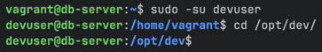

# COGSI CA4

This document is part of the _COGSI_ (Configuration and Systems Management) class from the Software Engineering master's
course at _ISEP_ (Instituto Superior de Engenharia do Porto).

The goal of this assignment was to **evolve Part 2 of CA3** by using **Ansible as a provisioner** in both virtual machines.  
This approach introduces a more modern and scalable configuration management tool, promoting the use of **idempotent automation**, **error handling**, and **infrastructure-as-code** practices.

Specifically, the task required to:
- Use **Ansible** to deploy and configure the **Spring REST application** on **host1 (web VM)**.
- Use **Ansible** to deploy and configure **H2 Database** on **host2 (db VM)**.
- Ensure all **playbooks are idempotent**, handling potential errors with `failed_when`, `ignore_errors`, and retry logic.
- Run the playbooks **twice**, ensuring the second run shows **0 or minimal changes** to confirm idempotency.

---

### 1. Virtual Machine Setup (Vagrantfile) and playbook organization

1. The Ansible provisioner was integrated directly in the `Vagrantfile` to execute specific playbooks on each VM. A global playbook was created in order to execute the tasks relevant to every deployment.
   1. ```config.vm.provision "ansible"``` defines Ansible as the provisioning tool for the VM. Other possible options include "shell" (for scripts) or "puppet".
   2. ```ansible.playbook``` specifies the path to the YAML playbook that should be executed.
   3. ```ansible.compatibility_mode = "2.0"``` ensures compatibility with newer Vagrant–Ansible integrations.
    ```ruby
    config.vm.provision "ansible" do |ansible|
        ansible.playbook = "./ansible/globalPlaybook.yml"
        ansible.compatibility_mode = "2.0"
    end
    ```

2. Besides this two other playbooks were also created, in order to separate application dependencies from the database and vice-versa
    ```ruby
    db.vm.provision "ansible" do |ansible|
        ansible.playbook = "./ansible/dbPlaybook.yml"
    end
    
    web.vm.provision "ansible" do |ansible|
        ansible.playbook = "./ansible/webPlaybook.yml"
    end
    ```

---

### 2. Global Configuration (globalPlaybook.yml)

1. This playbook applies a common base setup across all virtual machines, ensuring they share essential tools such as Git (for repository cloning) and OpenJDK 17 (for Java-based applications).
    ```ruby
    - name: Global VMs Provision
      hosts: all
      become: true
      tasks:
        - name: Install git
          apt:
            name: git
            state: present
            update_cache: yes
    
        - name: Install java
          apt:
            name: openjdk-17-jdk
            state: present
            update_cache: yes
    ```

1. Install git
   1. Git is required to clone the project repository containing the Spring REST application.
   2. Module: apt (used for managing Debian-based packages like Ubuntu).
   3. Options:
      1. name: git — specifies the package to install.
      2. state: present — ensures Git is installed. Possible values:
      3. present: installs the package if missing.
      4. absent: removes it.
      5. latest: upgrades it to the newest version.
      6. update_cache: yes — refreshes the package index before installation.
      7. yes: updates the cache to ensure the latest package metadata.
      8. no: skips update (faster but risk of outdated metadata).

2. Install java
   1. The Spring application and H2 database both require a Java runtime environment.
   2. Options: same as above, ensuring the package openjdk-17-jdk is installed with up-to-date dependencies.

3. Both tasks are idempotent, meaning that if Java or Git are already installed, running the playbook again will result in no changes.

### 3. Database Server Configuration (dbPlaybook.yml)

1. The database server playbook installs and configures H2 Database to run as a background service.
   This setup mimics a production-ready environment with persistent data and automatic startup.

    ```ruby
    - name: Database VM Provision
      hosts: db
      become: true
      tasks:
        - name: Download H2 Database
          get_url:
            url: https://repo1.maven.org/maven2/com/h2database/h2/2.4.240/h2-2.4.240.jar
            dest: /opt/h2-2.4.240.jar
    
        - name: Create shared directory for H2 database
          file:
            path: /vagrant/h2/h2db
            state: directory
            mode: '0770'
    
        - name: Create H2 server systemd service file
          copy:
            dest: /etc/systemd/system/h2db.service
            content: |
              [Unit]
              Description=H2 Database Server
              After=network.target
    
              [Service]
              ExecStart=/usr/bin/java -cp "/opt/h2-2.4.240.jar" org.h2.tools.Server -tcp -tcpAllowOthers -tcpPort 9092 -baseDir /vagrant/h2db -ifNotExists
              User=root
              Restart=always
    
              [Install]
              WantedBy=multi-user.target
    
        - name: Start H2 Database service
          systemd:
            name: h2db
            state: started
            enabled: true
    ```

1. Download H2 Database
   1. The H2 JAR file must be downloaded from the Maven repository to run the database server.
   2. Module: get_url (fetches files from remote URLs).
   3. Options:
      1. url: the download source.
      2. dest: local destination path.
      3. mode: optional; defines file permissions (not needed here).
      4. Idempotent behavior: If the file already exists with the same checksum, it won’t download again.
2. Create shared directory
   1. The H2 server stores its data files here. The /vagrant path is synced with the host machine.
   2. Module: file.
   3. Options:
      1. path: target directory path.
      2. state: directory: ensures the path is a directory.
      3. mode: '0770': sets Unix permissions (read/write/execute for owner and group only).
      4. Possible states: file, absent, touch, link, hard, etc.
3. Create systemd service file
   1. Allows the H2 database to start automatically and run persistently as a background service.
   2. Module: copy.
   3. Options:
      1. dest: where the file should be written.
      2. content: inline content for the service definition.
      3. Idempotent behavior: If the file already exists with the same content, it won’t overwrite.
4. Start H2 Database service
   1. Ensures that H2 starts immediately and remains active after reboots.
   2. Module: systemd.
   3. Options:
      1. name: service name.
      2. state: started — ensures the service is running.
      3. stopped: would stop the service.
      4. restarted: forces a restart.
      5. enabled: true — starts the service automatically at boot.
5. Idempotent: Only starts the service if it’s not already running.
   1. First run: service is created and started.
      
   2. Second run: no changes if the service is already active.
      

### 4. Web Server Configuration (webPlaybook.yml)

1. This playbook configures the web VM to deploy the REST API, connect it to the H2 database, and ensure it only runs once the DB is ready.
    ```ruby
    - name: Web VM Provision
      hosts: web
      become: true
      tasks:
        - name: Check if repo directory exists
          stat:
            path: /opt/cogsi2526-1211711-1210631
          register: repo_dir
    
        - name: Clone the repository
          git:
            repo: 'https://github.com/1211711/cogsi2526-1211711-1210631.git'
            dest: /opt/cogsi2526-1211711-1210631
          when: not repo_dir.stat.exists
    
        - name: Update H2 database URL in application.yaml
          lineinfile:
            path: /opt/cogsi2526-1211711-1210631/CA2/Part2/gradle-migration/src/main/resources/application.properties
            regexp: 'jdbc:h2:tcp://192.168.33.11:9092/database'
            line: 'jdbc:h2:tcp://192.168.33.11:9092/h2db'
    
        - name: Wait for H2 database to be ready
          wait_for:
            host: 192.168.33.11
            port: 9092
            delay: 1
            timeout: 3
            state: started
          retries: 5
          delay: 3
    ```

2. Check if repo directory exists
   1. Avoid cloning the repository multiple times.
   2. Module: stat (checks file or directory status).
   3. Options:
      1. path: location to check.
      2. Registers result in repo_dir, which is used later for conditional logic.
3. Clone the repository
   1. The application code is hosted in a GitHub repository.
   2. Module: git.
   3. Options:
      1. repo: URL of the Git repository.
      2. dest: destination path to clone into.
   4. Conditional:
      1. ```when: not repo_dir.stat.exists``` only clones if the directory doesn’t already exist.
   5. Idempotent: Ensures cloning happens only once.
4. Update H2 database URL
   1. Adjusts the Spring Boot configuration file so the application connects to the database VM.
   2. Module: lineinfile.
   3. Options:
      1. path: file to edit.
      2. regexp: regular expression to find the target line.
      3. line: replacement line.
   4. Idempotent: Only makes changes if the current line differs.
5. Wait for H2 database
   1. Ensures that the REST API starts only after the database is running.
   2. Module: wait_for.
   3. Options:
      1. host: IP address of the DB server.
      2. port: port number to check (9092 for H2).
      3. delay: seconds to wait before the first check.
      4. timeout: maximum wait time.
      5. state: started: waits until the port is open.
      6. retries and delay: retry logic for reliability.
   4. This improves provisioning resilience and avoids race conditions.
6. Idempotent: Only starts the service if it’s not already running.
   1. First run: service is created and started.
      
   2. Second run: no changes if the service is already active.
      

### 5. PAM Configuration
1. To enhance security, PAM (Pluggable Authentication Modules) was configured to enforce strong password policies on both VMs.
   This ensures that users must create passwords that meet specific complexity requirements.
   ```ruby
    - name: Install libpam-pwquality
      package:
        name: "libpam-pwquality"
        state: present

    - name: Configure pam_pwquality
      lineinfile:
        path: "/etc/pam.d/common-password"
        regexp: "pam_pwquality.so"
        line: "password required pam_pwquality.so minlen=12 lcredit=-1 ucredit=-1 dcredit=-1 ocredit=-1 minClass=3 enforce_for_root"
        state: present

    - name: Prevent reuse of last 5 passwords
      lineinfile:
        path: "/etc/pam.d/common-password"
        insertafter: "pam_pwquality.so"
        line: "password required pam_pwhistory.so remember=5 use_authtok enforce_for_root"
        state: present

    - name: Enable account lockout after 5 failed login attempts (lock 10 minutes)
      blockinfile:
        path: "/etc/pam.d/common-auth"
        insertafter: "auth"
        block: |
          auth required pam_tally2.so deny=5 onerr=fail unlock_time=600
   ```
   
2. Install libpam-pwquality 
   1. This package provides the pam_pwquality module for enforcing password complexity.
   2. Module: package.
   3. Options:
      1. name: package name.
      2. state: present ensures installation.
3. Configure pam_pwquality
   1. Sets password complexity requirements (minimum length, character types).
   2. Module: lineinfile.
   3. Options:
      1. path: configuration file.
      2. regexp: identifies the line to replace.
      3. line: new configuration line.
4. Prevent reuse of last 5 passwords
   1. Ensures users cannot reuse their last 5 passwords.
   2. Module: lineinfile.
   3. Options: similar to above, inserting after the pam_pwquality line.
5. Enable account lockout
   1. Locks user accounts after 5 failed login attempts for 10 minutes.
   2. Module: blockinfile.
   3. Options:
      1. path: configuration file.
      2. insertafter: position to insert the block.
      3. block: multi-line configuration to enforce lockout.

### 6. User and Group Creation
1. A dedicated user and group were created on both VMs to run the services securely. This configuration was added to the global playbook since it applies to both machines.
   ```ruby
    - name: Ensure group 'developers' exists
      group:
        name: developers
        state: present

    - name: Create the user 'devuser'
      user:
        name: devuser
        shell: /bin/bash
        password: $6$46fYmbHh0MQRB3pf$fG6UEoCDW5WkUjYmY9vNKX/nd2o9t3gaImEbQfRWWHy.wrE21gGNq6bxZLG9gTy683WlxdLz/8SkbtzjWsfuk0

    - name: Assign 'devuser' to the 'developers' group
      user:
        name: devuser
        groups: developers
        append: yes

    - name: Create a directory named 'dev'
      file:
        path: /opt/dev
        state: directory
        mode: 0750
        group: developers
   ```
2. Ensure group 'developers' exists
   1. Creates a group named 'developers' if it doesn't already exist.
   2. Module: group.
   3. Options:
      1. name: group name.
      2. state: present ensures the group is created.
3. Create the user 'devuser'
   1. Creates a user named 'devuser' with a specified shell and encrypted password.
   2. Module: user.
   3. Options:
      1. name: username.
      2. shell: login shell.
      3. password: encrypted password string.
4. Assign 'devuser' to the 'developers' group
   1. Adds 'devuser' to the 'developers' group.
   2. Module: user.
   3. Options:
      1. name: username.
      2. groups: group name.
      3. append: yes ensures the user is added to the group without removing existing groups.
5. Create a directory named 'dev'
   1. Creates a directory at /opt/dev with specific permissions and group ownership.
   2. Module: file.
   3. Options:
      1. path: directory path.
      2. state: directory ensures the path is a directory.
      3. mode: 0750 sets permissions (owner: read/write/execute, group: read/execute, others: none).
      4. group: developers sets group ownership.
   4. Folder permissions:
      1. Allowed
      
         
      
      2. Denied
      
         

## Alternative Solutions

While this assignment uses Ansible as the configuration management tool to automate PAM policies, user creation, and 
system hardening, alternative technologies exist that provide similar functionality and are widely used in DevOps environments.
Two of the most established tools in this space are Chef and Puppet.

Both aim to achieve Infrastructure as Code (IaC) — defining system configurations declaratively and applying them consistently 
across multiple servers — but differ in architecture, syntax, and execution models.

For this module, we will focus on Chef as an alternative solution.

### Chef
Chef is a Ruby-based automation framework that uses a pull-based model: each node runs a Chef client that retrieves configuration definitions (called recipes) from a central Chef server.
These recipes are grouped into cookbooks, describing the exact state of system resources such as packages, users, services, and configuration files.

Under Chef, the assignment would be structured into three cookbooks (or roles) to mirror the existing playbooks:

| Ansible              | Chef                        | Goal                                     |
|----------------------|-----------------------------|------------------------------------------|
| `globalPlaybook.yml` | `base` cookbook | Installs base packages, enforces PAM security, and manages users and groups                 |
| `dbPlaybook.yml`     | `database` cookbook | Downloads and configures the H2 database service                     |
| `webPlaybook.yml`    | `webapp` cookbook | Deploys the Spring Boot REST application and connects it to the database                 |

#### 1. Implementation Steps
1. **Base Cookbook**:
   - Use the `package` resource to install Git, OpenJDK 17 AND `libpam-pwquality`.
   - Use ruby blocks or `execute` resources to configure PAM policies for password complexity and account lockout.
      1. Use `file` resource to manage `/etc/pam.d/common-password` and `/etc/pam.d/common-auth`.
      2. Use `text` resource to append necessary lines for password history and lockout policies.
      3. Use file edit resources to ensure the correct PAM modules are configured with the desired parameters.
   - Use the `user` and `group` resources to create the `devuser` and `developers` group.
   - Use the `template` or `file` resource to manage PAM configuration files for password policies.
   - Use the `directory` resource to create the `/opt/dev` directory with appropriate permissions.
   
   ```ruby
      # Install required packages
      %w(git openjdk-17-jdk libpam-pwquality).each do |pkg|
        package pkg do
          action :install
        end
      end
      
      # Configure PAM password complexity
      ruby_block 'configure pam_pwquality' do
        block do
          file = '/etc/pam.d/common-password'
          text = 'password required pam_pwquality.so minlen=12 lcredit=-1 ucredit=-1 dcredit=-1 ocredit=-1 minClass=3 enforce_for_root'
          fe = Chef::Util::FileEdit.new(file)
          fe.search_file_replace_line(/pam_pwquality.so/, text)
          fe.write_file
        end
      end
      
      # Prevent reuse of last 5 passwords
      ruby_block 'prevent password reuse' do
        block do
          file = '/etc/pam.d/common-password'
          line = 'password required pam_pwhistory.so remember=5 use_authtok enforce_for_root'
          fe = Chef::Util::FileEdit.new(file)
          fe.insert_line_if_no_match(/pam_pwhistory.so/, line)
          fe.write_file
        end
      end
      
      # Enable account lockout after 5 failed attempts for 10 minutes
      ruby_block 'lockout policy' do
        block do
          file = '/etc/pam.d/common-auth'
          insert = "auth required pam_tally2.so deny=5 onerr=fail unlock_time=600"
          content = ::File.read(file)
          unless content.include?(insert)
            ::File.open(file, 'a') { |f| f.puts insert }
          end
        end
      end
      
      # Create group and user
      group 'developers'
      
      user 'devuser' do
        shell '/bin/bash'
        password '$6$46fYmbHh0MQRB3pf$fG6UEoCDW5WkUjYmY9vNKX/nd2o9t3gaImEbQfRWWHy.wrE21gGNq6bxZLG9gTy683WlxdLz/8SkbtzjWsfuk0'
        group 'developers'
      end
      
      # Create shared developer directory
      directory '/opt/dev' do
        owner 'root'
        group 'developers'
        mode '0750'
        recursive true
      end
   ```

### 2. **Database Cookbook**:
   - Use the `remote_file` resource to download the H2 database JAR file.
   - Use the `directory` resource to create the shared directory for H2 data.
   - Use the `template` resource to create a systemd service file for H2.
   - Use the `service` resource to start and enable the H2 service.
   - 
   ```ruby
   # Ensure base directory exists
   directory '/opt/dev' do
     owner 'root'
     group 'developers'
     mode '0750'
   end
   
   # Download H2 database JAR
   remote_file '/opt/dev/h2-2.4.240.jar' do
     source 'https://repo1.maven.org/maven2/com/h2database/h2/2.4.240/h2-2.4.240.jar'
     mode '0755'
     action :create
   end
   
   # Create shared H2 database directory
   directory '/vagrant/h2/h2db' do
     mode '0770'
     owner 'root'
     group 'developers'
     recursive true
   end
   
   # Create H2 Database systemd service
   file '/etc/systemd/system/h2db.service' do
     content <<~SERVICE
       [Unit]
       Description=H2 Database Server
       After=network.target
   
       [Service]
       ExecStart=/usr/bin/java -cp "/opt/dev/h2-2.4.240.jar" org.h2.tools.Server -tcp -tcpAllowOthers -tcpPort 9092 -baseDir /vagrant/h2db -ifNotExists
       User=root
       Restart=always
   
       [Install]
       WantedBy=multi-user.target
     SERVICE
     mode '0644'
   end
   
   # Enable and start H2 service
   service 'h2db' do
     action [:enable, :start]
   end
   ```

### 3. **Web Application Cookbook**:
   - Use the `git` resource to clone the application repository.
   - Use the `file` or `template` resource to update the application properties file with the correct database URL.
   - Use the `ruby_block` resource to implement a wait mechanism for the database to be ready before starting the application.

   ```ruby
      # Clone the Git repository if not present
      git '/opt/dev/cogsi2526-1211711-1210631' do
        repository 'https://github.com/1211711/cogsi2526-1211711-1210631.git'
        revision 'main'
        action :sync
      end
      
      # Update H2 connection URL in application.properties
      ruby_block 'update database URL' do
        block do
          file = '/opt/dev/cogsi2526-1211711-1210631/CA2/Part2/gradle-migration/src/main/resources/application.properties'
          text = 'jdbc:h2:tcp://192.168.33.11:9092/h2db'
          fe = Chef::Util::FileEdit.new(file)
          fe.search_file_replace_line(/jdbc:h2:tcp:\/\/192\.168\.33\.11:9092\/database/, text)
          fe.write_file
        end
      end
      
      # Wait for H2 database to be available before starting app
      ruby_block 'wait for H2 availability' do
        block do
          require 'socket'
          require 'timeout'
          begin
            Timeout.timeout(30) do
              TCPSocket.new('192.168.33.11', 9092).close
            end
          rescue
            Chef::Log.warn('Waiting for H2 database to start...')
            sleep 5
            retry
          end
        end
      end
      
      # Start the Spring Boot application
      execute 'run_spring_app' do
        command 'nohup java -jar /opt/dev/cogsi2526-1211711-1210631/CA2/Part2/gradle-migration/build/libs/*.jar &'
        cwd '/opt/dev'
        not_if 'pgrep -f gradle-migration'
      end
   ```

### 4. Chef vs Ansible: Key Differences and Advantages

Both Chef and Ansible are configuration management tools that implement the concept of Infrastructure as Code, allowing administrators to automate and maintain system configurations in a reproducible and idempotent way.
However, they differ significantly in their architecture, language, and operational philosophy.

Ansible follows a push-based, agentless model: the control node connects to target machines over SSH, executes YAML-defined playbooks, and applies changes immediately. This simplicity makes it lightweight, easy to learn, and ideal for smaller or short-lived environments such as academic labs or development setups.
It requires no persistent agents, and all configuration logic is expressed in a human-readable declarative format.

Chef, in contrast, is pull-based and agent-driven. Each managed node runs a Chef Client that periodically retrieves and applies configuration policies — known as cookbooks — from a central Chef Server. These cookbooks are written in Ruby DSL, providing more flexibility and reusability but also introducing a steeper learning curve.
This architecture is particularly effective in large or production-grade infrastructures where continuous configuration enforcement and drift correction are essential.

While Ansible is more focus on simplicity, speed, and accessibility, Chef offers greater scalability, modularity, and compliance integration through its own ecosystem.
Ansible is considered the more pragmatic choice in enterprise environments demanding continuous and large-scale infrastructure management. On the other hand chef becomes the more powerful long-term solution.

---

## Developers

| Name       |  Number | Evaluation |
| ---------- | :-----: | :--------: |
| João Sousa | 1210631 |    100%    |
| João Brito | 1211711 |    100%    |
