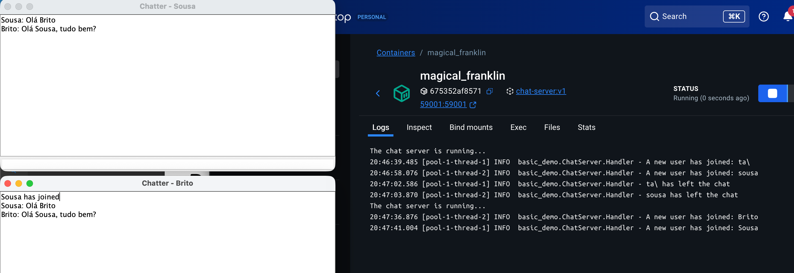
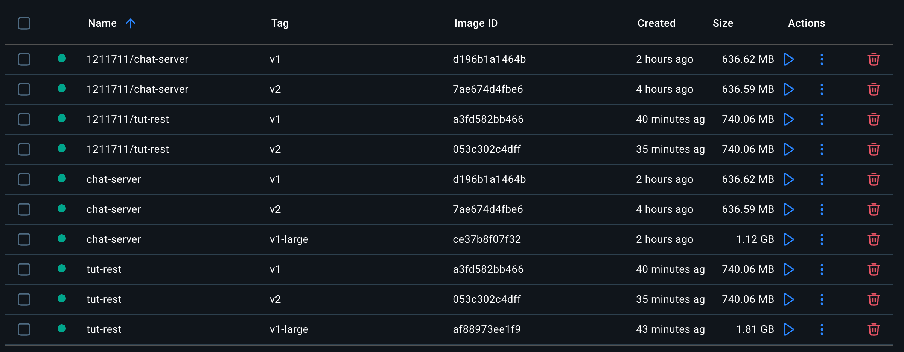
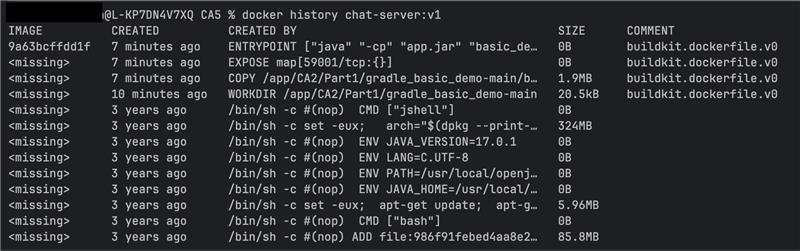
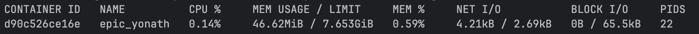
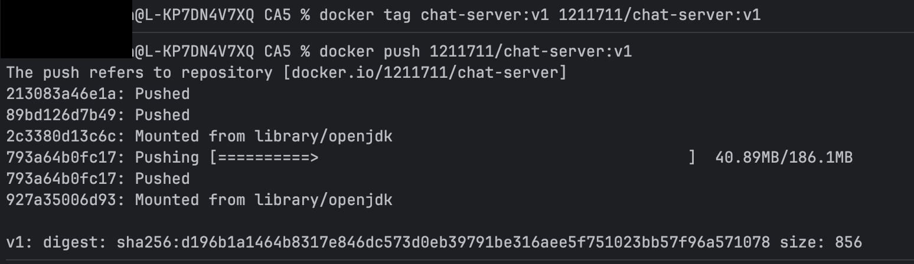
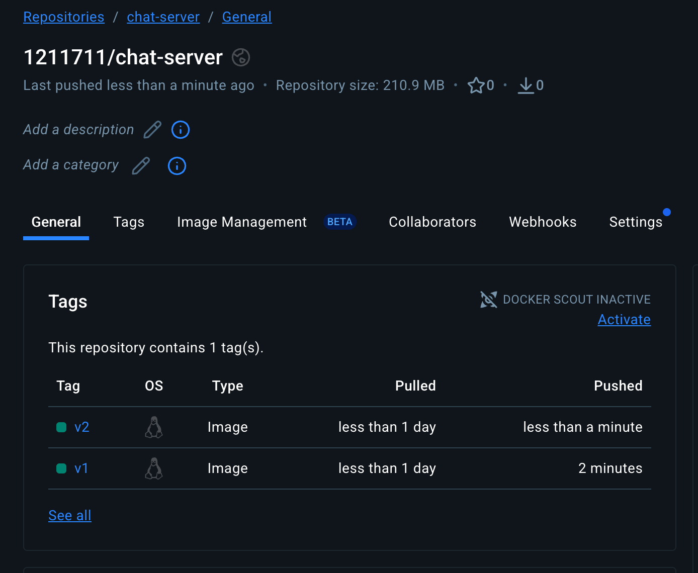
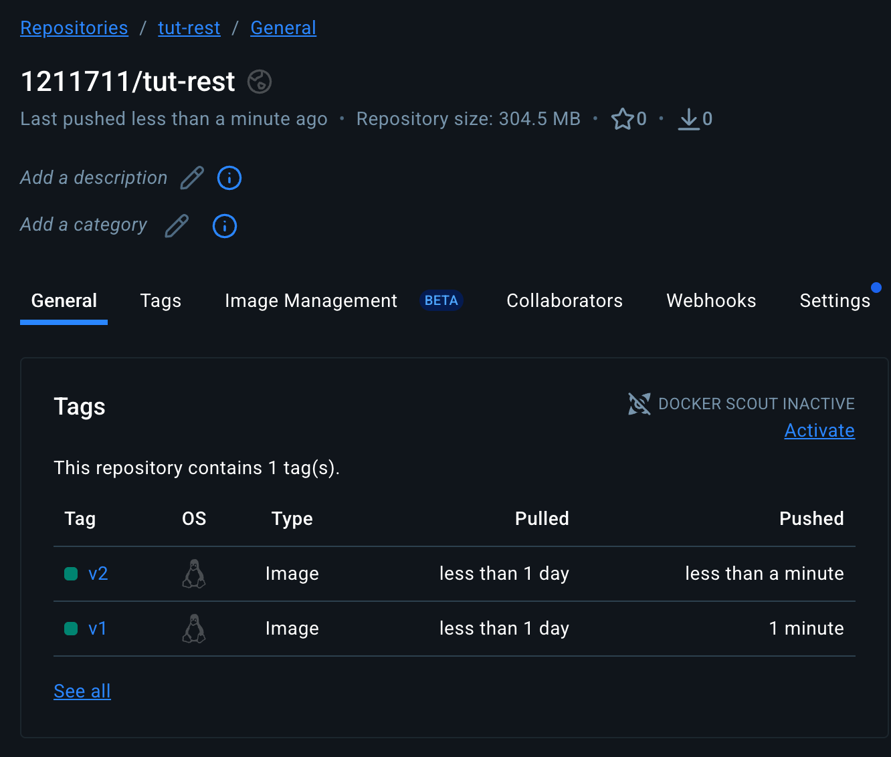
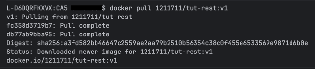

# COGSI CA5 - Detailed Docker Build Report

This document is part of the _COGSI_ (Configuration and Systems Management) class from the Software Engineering master’s course at _ISEP_ (Instituto Superior de Engenharia do Porto).

The goal of this assignment was to apply already known concepts used on previous assignment (CA3 and CA4) and apply them using docker, by containerizing both the Chat Server and the Tut REST Applications.  
Although the applications are quite different, the methods used to containerize them were very similar.

---

## 1. Chat Server

### 1.1 Image v1 - Multi-stage

This image **builds the application** entirely **inside _Docker_**. It Clones the repository, builds the application and runs it, all inside the container.
It's **fully automated** which means no manual steps required outside _Docker_.

```dockerfile
FROM openjdk:17.0.1-jdk-slim AS builder

WORKDIR /app

RUN apt update &&  \
    apt install -y git

# Clone and Build
RUN git clone https://github.com/1211711/cogsi2526-1211711-1210631.git /app

WORKDIR /app/CA2/Part1/gradle_basic_demo-main
RUN ./gradlew build -x test --no-daemon

# Setup the jar and build
FROM openjdk:17.0.1-jdk-slim
WORKDIR /app
COPY --from=builder /app/CA2/Part1/gradle_basic_demo-main/build/libs/*.jar app.jar

EXPOSE 59001

ENTRYPOINT ["java", "-cp", "app.jar", "basic_demo.ChatServerApp", "59001"]
```

1. Steps
   2. `FROM openjdk:17.0.1-jdk-slim AS builder` - uses a lightweight Java JDK image for building.
      1. `slim` reduces size by removing unnecessary packages.
   3. `WORKDIR /app` - sets the working directory inside the container.
   4. `RUN apt update && apt install -y git` - installs Git to clone the repository (required only during build stage).
   5. `RUN git clone` - clones the project into the container
      1. This avoids the need of manual copy from the host machine.
   6. `WORKDIR /app/CA2/Part1/gradle_basic_demo-main` - moves to project directory for Gradle build.
   7. `RUN ./gradlew build -x test --no-daemon` - builds the JAR inside the container.
      1. `-x test` - skips the tests for speed
      2. `--no-daemon` - instructs gradle to run in a single process without starting a background daemon, ensuring clean, reproducible Docker builds.
   8. `FROM openjdk:17.0.1-jdk-slim` - new image for runtime
      1.  `slim` reduces size by removing unnecessary packages.
   9. `COPY --from=builder` - copies only the built JAR.
   10. `EXPOSE 59001` - declares the port the app listens to.
   11. `ENTRYPOINT` - starts the Java application with the specified main class.

Pros: Ensures **reproducible builds**; final **image is small** since build tools are not included.

Cons: **Build** might **take longer** because everything (Git clone + Gradle build) runs inside the container

### 1.2 Image v1-large - Single-stage build

Similar to v1, but **no multi-stage**: clones repo, builds, and runs in a single image.

```dockerfile
FROM openjdk:17.0.1-jdk-slim

WORKDIR /app

RUN apt update &&  \
    apt install -y git

# Clone and Build
RUN git clone https://github.com/1211711/cogsi2526-1211711-1210631.git /app

WORKDIR /app/CA2/Part1/gradle_basic_demo-main
RUN ./gradlew build -x test --no-daemon

WORKDIR /app
COPY /app/CA2/Part1/gradle_basic_demo-main/build/libs/*.jar app.jar

EXPOSE 59001

ENTRYPOINT ["java", "-cp", "app.jar", "basic_demo.ChatServerApp", "59001"]
```

This image is a lot larger than the multistage one because it uses a **single-stage build** that includes the entire cloned 
repository, gradle build tools, and all build files in the final image. 
V1 is a multi-stage build that only copies the final JAR into a clean runtime image, leaving all build dependencies behind.

### 1.3 Image v2 - Prebuilt JAR

This image uses a prebuilt JAR copied from the host into the container. 

The application must be **built manually**, `./gradlew build`, on the host beforehand, and Docker only packages and runs the artifact. 
It is not fully automated since a host build is required.

```dockerfile
FROM openjdk:17.0.1-jdk-slim

WORKDIR /app

COPY build/libs/*.jar app.jar

EXPOSE 59001

ENTRYPOINT ["java", "-cp", "app.jar", "basic_demo.ChatServerApp", "59001"]
```

1. Steps:
   1. `WORKDIR /app` - sets the working directory inside the container. 
   2. `COPY` - copies only the built JAR, from the host machine, that was previously generate using gradle.
   3. `EXPOSE 59001` - declares the port the app listens to.
   4. `ENTRYPOINT` - starts the Java application with the specified main class.

Although size wise, this image is very similar to V1, the need of manual steps (such as the build), decrease a lot the value
of this approach.

### 1.4 Comparison and Analysis

In order to build each image there was the need to run the following command:

- `docker build -t chat-server:{imageVersion} .`
  - `-t chat-server:{imageVersion}` → names and tags the image.
    - Image version examples: v1, v1-large, v2.
  - `.` → specifies the build context (current directory).

Also in order to run the container after building the image the _docker_ run command was used:
- `docker run -d -p 59001:59001 chat-server:{imageVersion}`
  - `-d` - run in detached mode.
  - `-p host_port:container_port` - port mapping.



| Version  | Size  | Automation                  | Size     |
|----------|-------|-----------------------------|----------|
| v1       | small | fully automated             | 636.62MB |
| v1-large | large | fully automated             | 1.12GB   |
| v2       | small | requires host machine build | 636.59MB |

As it can be seen that v1 and v2 are similar in size because both include only the runtime and the final application JAR, 
with build tools and source code discarded or never included. 

On the other hand v1-large is much larger because it keeps the full repository, gradle caches, and build tools in the final image.

## 2. Tut Test Api

### 2.1 Image v1 - Multi-stage

This image is very similar to the chat server one. The only differences being the `WORKDIR` paths, the `git checkout` section and the execution (directly by jar).

```dockerfile
FROM openjdk:17.0.1-jdk-slim AS builder

WORKDIR /app

RUN apt update &&  \
    apt install -y git

# Clone and Build
RUN git clone https://github.com/1211711/cogsi2526-1211711-1210631.git /app

WORKDIR /app
RUN git fetch
RUN git checkout bugfix/no-issue/fix_tut_rest_application_properties

WORKDIR /app/CA2/Part2/gradle-migration
RUN ./gradlew build -x test --no-daemon

# Setup the jar and build
FROM openjdk:17.0.1-jdk-slim
WORKDIR /app
COPY --from=builder /app/CA2/Part2/gradle-migration/build/libs/*.jar app.jar

EXPOSE 8080

ENTRYPOINT ["java", "-jar", "app.jar", "8080"]
```

1. Steps (only relevant ones)
   1. `git fetch` - fetch all of the available branches.
   2. `git checkout` - checkouts to the desired branch. This was done since on the develop branch the application properties file was configured to connect to H2 via tcp (which is not the goal of this part).
   3. `ENTRYPOINT` - the entrypoint executes the jar file directly

### 2.2 Image v1-large - Single-stage build

```dockerfile
FROM openjdk:17.0.1-jdk-slim

WORKDIR /app

RUN apt update &&  \
    apt install -y git

# Clone and Build
RUN git clone https://github.com/1211711/cogsi2526-1211711-1210631.git /app

WORKDIR /app
RUN git fetch
RUN git checkout bugfix/no-issue/fix_tut_rest_application_properties

WORKDIR /app/CA2/Part2/gradle-migration
RUN ./gradlew build -x test --no-daemon

WORKDIR /app
COPY /app/CA2/Part2/gradle-migration/build/libs/*.jar app.jar

EXPOSE 8080

ENTRYPOINT ["java", "-jar", "app.jar", "8080"]
```

Once again the similarities between this and the chat server are obvious.

### 2.3 Image v2 - Prebuilt JAR

```dockerfile
FROM openjdk:17.0.1-jdk-slim

WORKDIR /app

COPY build/libs/*.jar app.jar

EXPOSE 59001

ENTRYPOINT ["java", "-jar", "app.jar", "8080"]
```

### 2.4 Comparison and Analysis

In order to build each image there was the need to run the following commands:

- `docker build -t tut-rest:{imageVersion} .`
  - `-t tut-rest:{imageVersion}` → names and tags the image.
    - Image version examples: v1, v1-large, v2.
  - `.` → specifies the build context (current directory).

Also in order to run the container after building the image the _docker_ run command was used:
- `docker run -d -p 8080:8080 tut-rest:{imageVersion}`
  - `-d` - run in detached mode.
  - `-p host_port:container_port` - port mapping.

| Version | Size | Automation                  | Size                                                                                       |
|---------|------|-----------------------------|--------------------------------------------------------------------------------------------|
| v1      | small | fully automated             | 740.06MB                                    
| v1-large| large | fully automated             | 1.81GB                           
| v2      | small | requires host machine build | 740.06MB 



The results were very similar, once again, to the chat server ones, were v1 and v2 have similar/identical sizes while v1-large is a completely different.

### 3. Docker history

Image Analysis and Monitoring

After building the different versions (v1, v1-large, and v2) for both applications, the _docker_ history command was used to inspect the layers of each image and identify how the build strategy affects their size and composition.

The command `docker history {imageName}:{imageVerion}` was ran, as it can be seen in the following example



The docker history command displays the layer-by-layer **history of a _Docker_ image**, showing how it was built and how much space each instruction adds. This can be very helpful in order to reduce image sizes.

### 4. Container monitoring

Firs there's the need of setting a container running:

- `docker run -d -p 8080:8080 tut-rest:{imageVersion}`
  - `-d` - run in detached mode.
  - `-p host_port:container_port` - port mapping.

Then in order to analyze resource usage during runtime, the command `docker stats` was executed:



These stats can also be seen directly in _docker_ desktop in a more user friendly way:


### 5. Tag and Publish

#### 5.1 Tag

In order to correctly tags the images in order to publish them, the following commands were used:

- `docker tag chat-server:v1 1211711/chat-server:v1`
- `docker tag chat-server:v1-large 1211711/chat-server:v1-large`
- `docker tag chat-server:v2 1211711/chat-server:v2`

- `docker tag tut-rest:v1 1211711/tut-rest:v1`
- `docker tag tut-rest:v1-large 1211711tut-rest:v1-large`
- `docker tag tut-rest:v2 1211711/tut-rest:v2`

#### 5.2 Publish

Publishing images to _Docker Hub_ makes them easy to share, deploy, and reuse across different systems. 
It provides a central repository for consistent, versioned images. This **increases team collaboration** and **helps automated deployments** and reproducible environments without needing to rebuild locally.

In order to publish the images to _docker hub_, the following command were used:

- `docker push 1211711/chat-server:v1`
- `docker push 1211711/chat-server:v1-large`
- `docker push 1211711/chat-server:v2`

- `docker push 1211711/tut-rest:v1`
- `docker push 1211711/tut-rest:v1-large`
- `docker push 1211711/tut-rest:v2`



With this, the images were correctly published to _docker hub_, as it can be seen:





Now we can execute `docker pull` in order to pull the relevant images from the _docker hub_ itself, for example:



With this _docker_ retrieves a specific image and all its layers, storing them locally so that we can create containers using it.

---

## Developers

| Name       |  Number | Evaluation |
| ---------- | :-----: | :--------: |
| João Sousa | 1210631 |    100%    |
| João Brito | 1211711 |    100%    |
