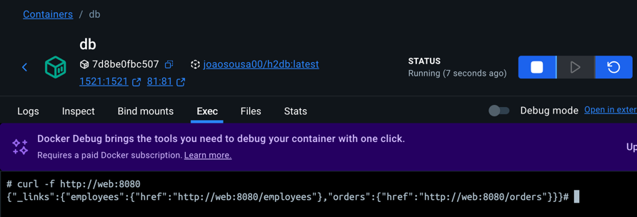
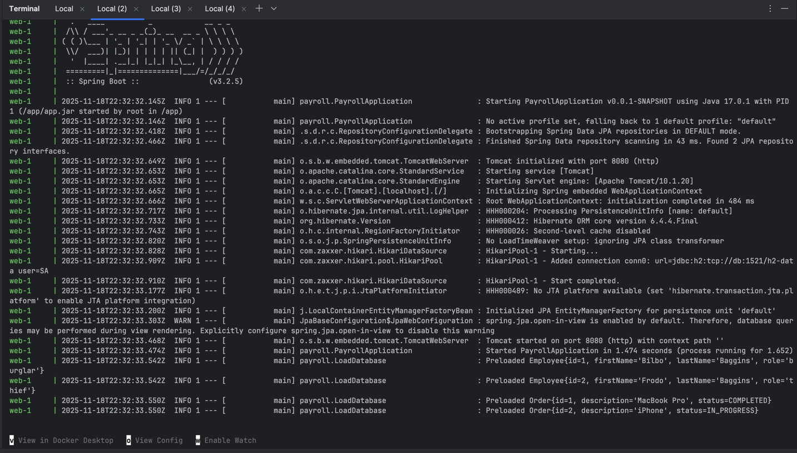
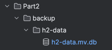
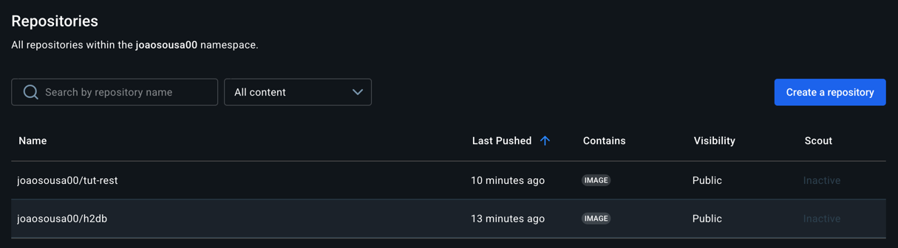

# COGSI CA5 PART2 - Detailed Docker Compose Report

This document is part of the _COGSI_ (Configuration and Systems Management) class from the Software Engineering master’s course at _ISEP_ (Instituto Superior de Engenharia do Porto).

This goal of this assignment was to containerize the Gradle version of the Building REST Services with Spring application and run it together with an H2 database using Docker Compose.

---

## 1. Database H2 Base Configuration

The db service runs an H2 database in TCP server mode and exposes a Web Console for administration.

```dockercompose
  db:
    image: joaosousa00/h2db
    ports:
      - "81:81"
      - "1521:1521"
    hostname: db
    container_name: db
    environment:
      - H2_OPTIONS=-ifNotExists -web -webAllowOthers -tcp -tcpAllowOthers
```

1. Image: oscarfonts/h2 (latest)
    1. Chosen because it provides a preconfigured H2 server with TCP and Web support, simplifying deployment.
    2. The image was pulled from Docker Hub, then tagged and pushed to our Docker Hub repository `joaosousa00/h2db` mainly to:
        - Ensure reproducibility
        - Allow version control
2. Ports Exposed:
    1. `1521` → JDBC connections for Spring Boot
    2. `81` → H2 Web Console for monitoring
3. Container Hostname: `db`
    1. Ensures predictable connectivity from the web container
4. H2 Options: `-ifNotExists -web -webAllowOthers -tcp -tcpAllowOthers`
    1. Enables new database creation if missing
    2. Allows external TCP and Web connections from other containers
5. Container Name: `db`
    1. Simplifies container management and troubleshooting
  
## 2. Web Base Configuration

The web service hosts the Spring Boot Tut REST application, exposing its API to the host machine and connecting to the db container.

```dockercompose
  web:
    image: joaosousa00/tut-rest:part2
    ports:
      - "8000:5000"
```

1. Image: `joaosousa00tut-rest:part2`
    1. A new image using the dockerfile created in the previous assignment was tagged, created and pushed to dockher hub
2. Ports: `5000` internal mapped to `8000` on the host

## 3. Database Healthcheck and Web Depends On

To avoid startup errors where the web application connects to an unavailable database, a health check was added to the db container. 
Besides this a condition on the web container was also addressed, making sure web only startups when the db is healthy.

```dockercompose
services:
  db:
    ...
    healthcheck:
      test: [ "CMD", "curl", "-f", "http://localhost:81" ]
      interval: 30s
      retries: 3
      start_period: 10s
      timeout: 10s
    networks:
      app_network:
    ...

  web:
    depends_on:
      db:
        condition: service_healthy
    networks:
      app_network:

networks:
  app_network:
```

1. Healthcheck command: `[ "CMD", "curl", "-f", "http://localhost:81" ]`
    1. Periodically checks that the H2 Web Console is responding
    2. Timing parameters:
        - `interval: 30s, timeout: 10s, retries: 3, start_period: 10s`
2. Web dependency: `depends_on: db: condition: service_healthy`
    1. Guarantees that the Spring Boot application only starts once the database is ready, avoiding connection failures
    2. Reason: ensures reliable startup sequencing and avoids race conditions between containers
3. Network setup
    1. All services are connected to a custom Docker network to enable hostname-based communication.
    2. Allows the `web` container to connect to the `db` container using `db` as hostname
    3. Isolates the application from other Docker containers
    4. Ensures predictable container-to-container communication
  




## 4. Database Volume and Backup

Persistence is critical to avoid losing data when containers restart or are rebuilt.

```dockercompose
services:
  db:
    ...
    volumes:
      - db_data:/opt/h2-data
    ...

  backup:
    image: alpine
    command: [ "sh", "-c", "cp -r /opt/h2-data /backup" ]
    volumes:
      - db_data:/opt/h2-data:ro
      - ./backup:/backup
    networks:
      - app_network

volumes:
  db_data:
```

1. Volume: `db_data`
    1. Mounted path: `/opt/h2-data` inside the container
2. Backup Service: copies `/opt/h2-data` to the host `./backup` to demonstrate persistence
    1. Importance: ensures durable storage, data survives container lifecycle changes, and facilitates backups
    2. Uses `alpine` since it's an image ideal for small, temporary tasks, due to it being very lightweight
    3. Copies the database files from the named volume `db_data` to a folder on the host machine `./backup`
         - Note that the volume was `ro` specified, which means readonly permission
    5. Ensures persistent backup outside of Docker containers, allowing data recovery even if containers are removed or rebuilt
    6. Also connected to the existing network
  


## 5. Environment File (web.env)

Environment variables allow the web container to connect to the database without hardcoding credentials.

```env
DB_URL=jdbc:h2:tcp://db:1521/h2-data
DB_USERNAME=sa
DB_PASS=
```

```dockercompose
  web:
      ...
      env_file:
        - web.env
      ...
```

1. `web.env` file
    1. Contains the variable values to be populated 
2. Loaded in Docker Compose via `env_file`
    1. Injected into Spring Boot via `application.properties`
3. `application.properties` file update
    1. The `application.properties` was updated in order to support the new variables:
        - `spring.datasource.url=${DB_URL:jdbc:h2:tcp://192.168.33.11:9090/database}`
    2. This allows the variable to be overrided while still maintaining a default value
    3. It allows easy reconfiguration for different environments and avoids storing secrets in the Dockerfile

## 6. Images on Docker Hub

Both web and db images were tagged and pushed into docker hub, as already previously mentioned

Tagging:

- `docker tag tut-rest:part2 joaosousa00/tut-rest:part2`
- `docker tag h2db:latest joaosousa00/h2db:latest`

Push to Docker Hub:

- `docker push joaosousa00/tut-rest:part2`
- `docker push joaosousa00/h2db:latest`



---

## Developers

| Name       |  Number | Evaluation |
| ---------- | :-----: | :--------: |
| João Sousa | 1210631 |    100%    |
| João Brito | 1211711 |    100%    |
