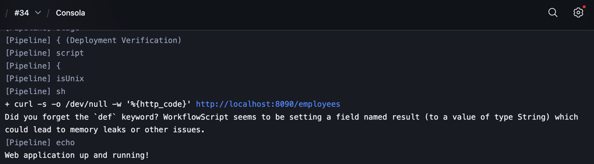
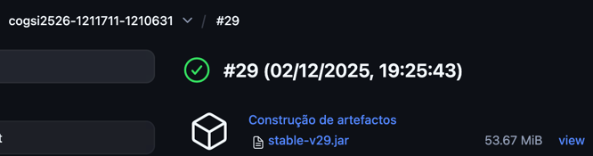
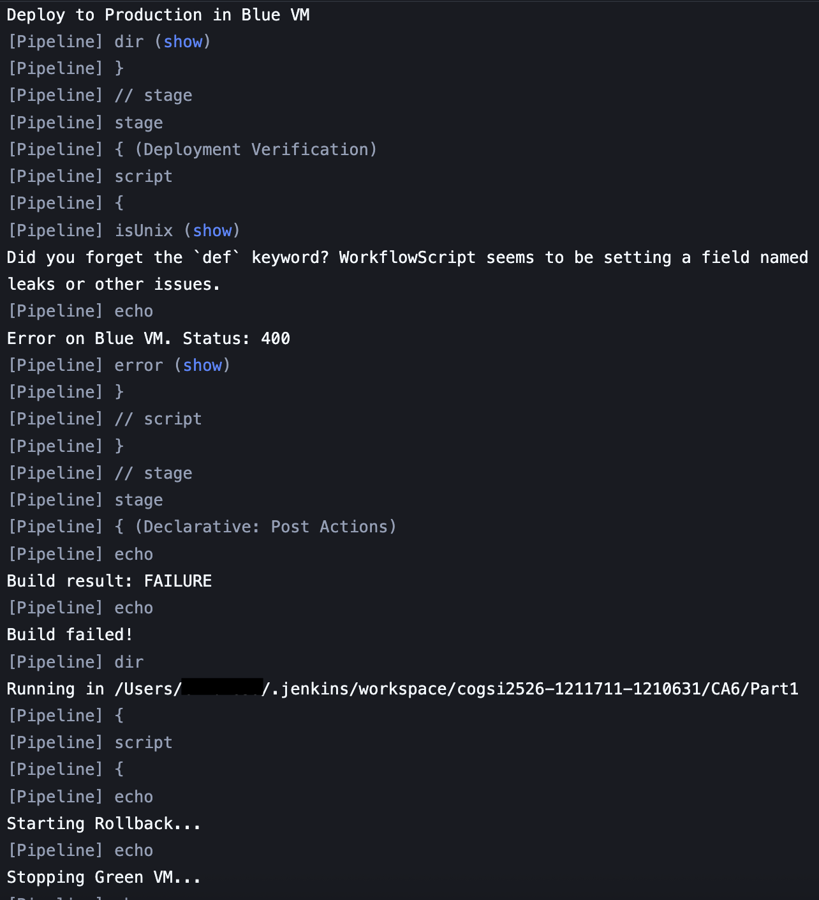
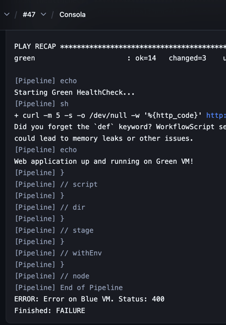
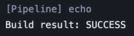

# COGSI CA6 – PART 1

This document is part of the COGSI (Configuration and Systems Management) class from the Software Engineering master’s course at ISEP – Instituto Superior de Engenharia do Porto.

The goal of Part 1 of this assignment was to implement a CI/CD pipeline using Jenkins, capable of building the Gradle version of the Building REST Services with Spring application, 
and automatically deploying it to a Blue VM using Vagrant and Ansible provisioning, with artifact archiving, stable build tagging, deployment verification and rollback to a Green VM in case of failure.

---

## 1. Infrastructure (Vagrant + Ansible)

To support *Blue/Green* deployment, two machines were provisioned using *Vagrant* and configured through *Ansible* playbooks.

A global playbook installs common dependencies, while blue and green playbooks handle application deployment. This is very similar to the previous assignments done regarding Vagrant and Ansible.

### 1.1 Vagrant
```ruby
# -*- mode: ruby -*-
# vi: set ft=ruby :

Vagrant.configure("2") do |config|
  config.vm.box = "bento/ubuntu-22.04"

  config.vm.provision "ansible" do |ansible|
      ansible.playbook = "./ansible/globalPlaybook.yml"
      ansible.compatibility_mode = "2.0"
  end

  config.vm.define "blue" do |blue|
    blue.vm.network "forwarded_port", guest: 8080, host: 8090

    blue.vm.provision "ansible" do |ansible|
        ansible.playbook = "./ansible/bluePlaybook.yml"
        ansible.compatibility_mode = "2.0"
    end
  end

  config.vm.define "green" do |green|
    green.vm.network "forwarded_port", guest: 8080, host: 8091

    green.vm.provision "ansible" do |ansible|
        ansible.playbook = "./ansible/greenPlaybook.yml"
        ansible.compatibility_mode = "2.0"
    end
  end
end
```

1. Blue - Deployment target
2. Green - Fallback VM used during rollback

### 1.2 Global Playbook

Installs core dependencies common to both VMs, ensuring a consistent execution environment.

```ruby
- name: Global VMs Provision
  hosts: all
  become: true
  tasks:
    - name: Install java
      apt:
        name: openjdk-17-jdk
        state: present
        update_cache: yes
```

### 1.3 Blue Playbook

The Blue VM is used as the target VM for the deployment.

```ruby
- name: Blue VM Provision
  hosts: blue
  become: true
  tasks:
    - name: Download last stable artifact version
      get_url:
        url: http://10.0.2.2:8080/job/cogsi2526-1211711-1210631/lastBuild/artifact/CA2/Part2/gradle-migration/build/libs/tut-rest-0.0.1-SNAPSHOT.jar
        dest: /opt/tut-rest-0.0.1-SNAPSHOT.jar
      ignore_errors: true

    - name: Download H2 Database
      get_url:
        url: https://repo1.maven.org/maven2/com/h2database/h2/2.4.240/h2-2.4.240.jar
        dest: /opt/h2-2.4.240.jar

    - name: Create shared directory for H2 database
      file:
        path: /vagrant/h2/h2db
        state: directory
        mode: '0770'

    - name: Create H2 server systemd service file
      copy:
        dest: /etc/systemd/system/h2db.service
        content: |
          [Unit]
          Description=H2 Database Server
          After=network.target

          [Service]
          ExecStart=/usr/bin/java -cp "/opt/h2-2.4.240.jar" org.h2.tools.Server -tcp -tcpAllowOthers -tcpPort 9092 -baseDir /vagrant/h2db -ifNotExists
          User=root
          Restart=always

          [Install]
          WantedBy=multi-user.target

    - name: Start H2 Database service
      systemd:
        name: h2db
        state: started
        enabled: true

    - name: Port HealthCheck
      wait_for:
        host: "localhost"
        port: 9092
        state: started
        timeout: 5

    - name: Wait for H2 database to be ready
      wait_for:
        host: localhost
        port: 9092
        delay: 1
        timeout: 3
        state: started
      retries: 5
      delay: 3

    - name: Run the application
      command: "java -jar tut-rest-0.0.1-SNAPSHOT.jar"
      args:
        chdir: /opt
      async: 600
      poll: 0

    - name: Healthcheck
      uri:
        url: http://localhost:8080/employees
        method: GET
        return_content: true
      register: http_check
      until: http_check.status == 200
      retries: 5
      delay: 10
      failed_when:
        - http_check.status != 200
        - "Unhealthy application response"
      ignore_errors: true
```

1. Downloads the jar file for web (using the Jenkins *last build* artifact) and h2db.
2. Updates application properties for local DB execution.
3. Installs and configures H2 database as a systemd service.
4. Builds and runs the Spring Boot application via the downloaded jar file.
5. Performs health checks ensuring correct deployment.

This is very standard and was based on the previous assignments done.

### 1.4 Green Playbook

The Green VM is used as the VM for the rollback in case of failure.

```ruby
- name: Green VM Provision
  hosts: green
  become: true
  tasks:
    - name: Download last stable artifact version
      get_url:
        url: http://10.0.2.2:8080/job/cogsi2526-1211711-1210631/lastStableBuild/artifact/CA2/Part2/gradle-migration/build/libs/tut-rest-0.0.1-SNAPSHOT.jar
        dest: /opt/tut-rest-0.0.1-SNAPSHOT.jar
      ignore_errors: true

    - name: Download H2 Database
      get_url:
        url: https://repo1.maven.org/maven2/com/h2database/h2/2.4.240/h2-2.4.240.jar
        dest: /opt/h2-2.4.240.jar

    - name: Create shared directory for H2 database
      file:
        path: /vagrant/h2/h2db
        state: directory
        mode: '0770'

    - name: Create H2 server systemd service file
      copy:
        dest: /etc/systemd/system/h2db.service
        content: |
          [Unit]
          Description=H2 Database Server
          After=network.target

          [Service]
          ExecStart=/usr/bin/java -cp "/opt/h2-2.4.240.jar" org.h2.tools.Server -tcp -tcpAllowOthers -tcpPort 9092 -baseDir /vagrant/h2db -ifNotExists
          User=root
          Restart=always

          [Install]
          WantedBy=multi-user.target

    - name: Start H2 Database service
      systemd:
        name: h2db
        state: started
        enabled: true

    - name: Port HealthCheck
      wait_for:
        host: "localhost"
        port: 9092
        state: started
        timeout: 5

    - name: Wait for H2 database to be ready
      wait_for:
        host: localhost
        port: 9092
        delay: 1
        timeout: 3
        state: started
      retries: 5
      delay: 3

    - name: Run the application
      command: "java -jar tut-rest-0.0.1-SNAPSHOT.jar"
      args:
        chdir: /opt
      async: 600
      poll: 0

    - name: Healthcheck
      uri:
        url: http://localhost:8080/employees
        method: GET
        return_content: true
      register: http_check
      until: http_check.status == 200
      retries: 5
      delay: 5
      failed_when:
        - http_check.status != 200
        - "Unhealthy application response"
      ignore_errors: true
```

This VM is a basically copy of Blue. The main change is the image used for the deployment. 
In this VM the *latest stable* image (.jar) available is downloaded and used in order to execute the rollback.

In order to download it, the *Jenkins API* is used. This will retrieve the desired .jar file based on the latest stable build.
Some nuances, such as the host ip, were modified in order to enable the VM to access the local user machine. 

The mentioned IP is an existing default setup done by virtual box itself to simplify the process of accessing the host machine.

## 2. Jenkins Pipeline

To orchestrate the *CI/CD* workflow, *Jenkins* was installed and accessed locally. In this case `homebrew` was used. 
Upon installing it, all of the default plugins were also installed in order to minimize the effort.

In order to start Jenkins itself, so it can be accessed, `brew services start jenkins-lts` was done, enabling Jenkins to be accessed on `localhost:8080`.

Besides the initial default plugins, *Jenkins* was also configured with:

  - *HTML Publisher* plugin for unit test reports

There was also the need to configure the Vagrant agent on Jenkins. For this the following steps were executed:
  1. Open Jenkins and go to _Manage Jenkins -> System -> Global Properties -> Environment Variables_.
  2. Here there's the need of specifiyng the directory of where Vagrant is installed, which in this case was `opt/homebrew/bin/`.

Once Jenkins was running, we manually created a Pipeline and configured it to use the Jenkinsfile stored in our repository, rather than writing pipeline steps inside the UI.
This separation reinforces DevOps best practices. The jenkins file then has all of the steps that compose the pipeline itself. 
Since the development of the pipeline was done on a separate branch, the `feature/issue-28/create_a_pipeline_to_deploy_rest_service_in_a_vm` branch was the only one included in the _branches to build_ section.

```jenkinsfile
pipeline {
     agent any

     options {
          skipStagesAfterUnstable()
          skipDefaultCheckout(true)
     }

     environment {
        DIR = 'CA2/Part2/gradle-migration'
        GRADLEW = './CA2/Part2/gradle-migration/gradlew -p CA2/Part2/gradle-migration'
        BLUE = "400"
     }

     stages {
        stage('Repository Checkout') {
               steps {
                    echo 'Repository Checkout'
                    checkout scm
               }
        }

        stage('Build Step') {
               steps {
                    echo 'Generating deployment file'
                    echo "Running Build ${env.BUILD_ID}"

                    script {
                        if (isUnix()) {
                              sh '${GRADLEW} clean build'
                        } else {
                              bat '${GRADLEW} clean build'
                        }
                    }

                    archiveArtifacts artifacts: 'CA2/Part2/gradle-migration/build/libs/*.jar'
               }
        }

        stage('Unit Tests') {
               steps {
                    echo 'Unit Tests'

                    script {
                        if (isUnix()) {
                              sh '${GRADLEW} test'
                        } else {
                              bat '${GRADLEW} test'
                        }
                    }
               }
        }

        stage('Unit Tests HTML Report Publish') {
               steps {
                    echo 'Publishing Unit Tests HTML Report'

                    publishHTML([allowMissing: false, alwaysLinkToLastBuild: false, keepAll: false, reportDir: 'CA2/Part2/gradle-migration/build/reports/tests/test', reportFiles: 'index.html', reportName: 'Unit Tests HTML Report', reportTitles: '', useWrapperFileDirectly: true])
               }
        }

        stage('UI Acceptance Tests') {
               steps {
                    echo 'Wait for user confirmation...'
                    timeout(time: 5, unit: 'MINUTES') {
                         input(id: 'Deploy_Application',
                        message: 'Deploy to Production?',
                        ok: 'Yes')
                    }
               }
        }

        stage('Deploy application to Blue VM') {
               steps {
                    echo 'Deploy to Production in Blue VM'

                    dir('CA6/Part1') {
                        script {
                            if (isUnix()) {
                                  sh 'vagrant up blue --provision'
                            } else {
                                  bat 'vagrant up blue --provision'
                            }
                        }
                    }
               }
        }

        stage('Deployment Verification') {
                steps {
                    script {
                        final String url = "http://localhost:8090/employees"

                        if (isUnix()) {
                            result = sh(script: 'curl -m 5 -s -o /dev/null -w \"%{http_code}\" http://localhost:8090/employees', returnStdout: true)
                            if (result == '200' || result == '302') {
                                echo 'Web application up and running on Blue VM!'
                                env.BLUE = "200"
                            } else {
                                echo "Error on Blue VM. Status: ${result}"
                                error("Error on Blue VM. Status: ${result}")
                            }
                        } else {
                            bat(script: "curl -s -o -w $url", returnStdout: true)
                            echo 'Web application up and running!'
                        }
                    }
                }
        }

     }

    post {
       success {
            echo 'Build was successful!'
            script {
                def myTag = "stable-v${env.BUILD_NUMBER}"

                sh "cp CA2/Part2/gradle-migration/build/libs/tut-rest-0.0.1-SNAPSHOT.jar CA2/Part2/gradle-migration/build/libs/stable-v${env.BUILD_NUMBER}.jar"
            }

            archiveArtifacts artifacts: "CA2/Part2/gradle-migration/build/libs/stable-v${env.BUILD_NUMBER}.jar"
            echo 'Repository commit tag updated with the build result.'
       }

       always {
            echo "Build result: ${currentBuild.currentResult}"
       }

       failure {
            echo "Build failed!"

            dir('CA6/Part1') {
                script {
                    if (env.BLUE != "200") {
                        echo "Starting Rollback..."

                        echo "Stopping Green VM..."
                        sh "vagrant halt green"

                        echo "Starting Green VM with last stable version..."
                        sh "vagrant up green --provision"

                        echo "Starting Green HealthCheck..."
                        result = sh(script: 'curl -m 5 -s -o /dev/null -w \"%{http_code}\" http://localhost:8091/employees', returnStdout: true)
                        if (result == '200' || result == '302') {
                            echo 'Web application up and running on Green VM!'
                            env.BLUE = "200"
                        } else {
                            echo "Error on Green VM. Status: ${result}"
                            error("Error on Green VM. Status: ${result}")
                        }
                    }
                }
            }
       }
    }
}
```

1. **Options**
    1. `skipStagesAfterUnstable()` - if a stage sets the build result to UNSTABLE, subsequent stages will be skipped. Useful to avoid wasting resources after test failures.
    2. `skipDefaultCheckout(true)` — Prevents Jenkins from doing the implicit checkout scm at the start.
2. **Environment**
    1. Contains environment varibles that are used during the stages of the pipeline
3. **Repository checkout**
    1. Pulls the repository that triggered the pipeline (scm is the Jenkins SCM configured for the job)
4. **Build Step**
    1. Runs Gradle build using the wrapper defined in *GRADLEW*. Uses platform detection: sh on Unix, bat on Windows.
    2. `archiveArtifacts` - Archives *.jar files found in the build output into Jenkins build artifacts for later retrieval. This is what makes the artifact available for the VMs to download.
5. **Unit tests**
    1. Runs unit tests separately using the existing gradle task for it.
6. **Unit Tests HTML Report Publish**
    1. Publishes the generated HTML test report to Jenkins, as an artifact, using the HTML Publisher plugin.
7. **UI Acceptance Tests**
    1. Pauses the pipeline and waits for a human approv (Yes). This is makes the pipeline more controllable and less prone to _missclicks.
8. **Deploy application to Blue VM**
    1. Boots the Blue VM via Vagrant from the repository folder CA6/Part1 and triggers the provisioning.
    2. The main logic in this section is inside the Blue VM ansible file itself.
9. **Deployment Verification**
    1. Verifies if the application deployed on Blue VM is reachable and returns a valid HTTP code
    2. If the http code means success (200 or 302), sets the `BLUE` environment variable in order to be used later to ignore the rollback.
    3. If the http code means failure, it throws an error.
    4. 
10. **Post**
    1. This represents all of the post execution actions.
        - `success` - when the pipeline succeeds.
        - `failure` - when the pipeline fails.
        - `always` - the pipeline state does not matter, it will always execute this section.
    2. `success`
        1. Creates a copy of the built JAR named stable-v<buildnumber>.jar. This allows us to tag a stable version of the artifact. The build number of the pipeline was used as the version, preventing duplication and overrides.
        2. Archives the stable artifact. This is now accessible via the Jenkins _lastStableBuild_ artifact URL (which the Green playbook later downloads).
        3. 
    4. `failure`
        1. Checks if the deployment verification was successfull using the `BLUE` variable.
        2. If the Blue deployment failed, proceeds with rollback.
            - Stops Green VM with `vagrant halt green` to ensure a clean restart.
            - Boots Green with `vagrant up green --provision`. The Green playbook downloads the archived stable artifact from Jenkins using the endpoint already mentioned previously.
            - 
            - Performs healthcheck on `http://localhost:8091/employees`. If Green returns a success code (200 or 302), it means that the rollback was successfull, otherwise the pipeline throws an error.
            - 
    3. `always`
        1. Prints the final build result no matter success/failure.

Throughout the pipeline, multiple logs were added, in order to indicate the state of it's build in a continously and valuable way.




---

## Developers

| Name       |  Number | Evaluation |
| ---------- | :-----: | :--------: |
| João Sousa | 1210631 |    100%    |
| João Brito | 1211711 |    100%    |
